# Fault Injection

## Faulting Security Mechanisms

Devices have multiple security mechanisms that can be targeted for fault injection attacks. These can include JTAG ports, firmware digital signatures, and inaccessible hardware keys.

Engineers typically use a single bit to represent an access-granted state and assume that the bit holds its value until instructed to change by the software controller.

Fault injection is quite random, making it difficult to precisely hit the one bit that will break a security mechanism. Even with a magical fault injector that can flip one bit at a single specific point in time, it is still challenging to achieve this level of precision in practice. Such a device is rare and difficult to obtain, with micro-probing being an alternative but more advanced physical attack method.

Fault injection can be used to circumvent various security mechanisms, such as flipping the Boolean that holds the (in)valid signature state during firmware signature verification, flipping the lock bit on locked functionality such as a crypto engine, and even flipping bits during the execution of a cryptographic algorithm to recover cryptographic key material.

### **Circumventing Firmware Signature Verification**

Modern devices use firmware images stored in a flash memory to boot. To prevent booting from hacked firmware images, manufacturers sign them digitally and store the signature next to the firmware image. During boot, the firmware image is inspected, and the signature is verified using a public key linked to the manufacturer. However, the device must eventually make a binary decision to boot or not, which can be manipulated with a controlled fault injector even if the image has been modified. A single fault in the right location can compromise all the security.

If an attacker gains runtime access during a device's boot, they can compromise any software loaded thereafter, starting from the operating system up to the applications.

### **Recovering Cryptographic Keys**

Attacking cryptographic algorithms involves performing decryption on known input data, sometimes with fault injection during the decryption process. By analyzing the differences between correct and faulty cipher outputs, we can determine the cryptographic key.

Known Differential Fault Analysis (DFA) attacks exist on AES, 3DES, RSA-CRT, and ECC cryptographic algorithms. For example, known DFA attacks on 3DES require less than 100 faults to achieve full key retrieval, and the classic attack on RSA-CRT only requires one fault to retrieve an entire RSA private key.

Non-DFA attacks on cryptographic algorithms can be achieved by faulting a cipher implementation to run for only one round, skipping key additions, partially zeroing-out keys, or other corruptions. However, these methods require analysis of the algorithm's cryptographic properties and the fault to retrieve a key from a faulty execution. In some cases, memory dumps can also obtain key material. More about DFA in chapter 6.

## An Exercise in OpenSSH Fault Injection

### **Injecting Faults into C Code**

Inspecting OpenSSH 7.2p2 Code, To attempt a fault injection during the password prompt phase:

<figure><figcaption>
<em>Figure 4.1: OpenSSH password authentication code in auth2-passwd.c</em>
</figcaption></figure>

The `userauth_passwd` Function is responsible for the “Yes/No” of password correctness, and The `Authenticated` Variable on line 54 indicates valid access. Theoretically faulting this code can be done by doing the following:

* Flipping the authenticated flag to be nonzero (Line 54)
* Changing the return value, the outcome, or the checked value (Line 70)
* Requesting a password change to the code, setting `change == 1`, then faulting `newpass` (line 62) to be pointing to the same spot as `password`, Then exploiting the double `free` which allows us to free the same memory at lines 64 and 73 through software exploitation.

Various fault scenarios can be successfully achieved in practice. While some are basic faults, others require more precise timing or specific effects, making them less likely to succeed. Tracking the code leading to the auth\_password() function reveals dozens of more potential fault opportunities.

## Fault Injection Bull

Until We have a magical single-bit fault injector, which does not exist in reality. We will explore more realistic methods of causing useful faults. These methods include overclocking or under-volting a circuit, overheating it, and using techniques such as strong electromagnetic pulses, focused laser pulses, or radiation by alpha particles or gamma rays. While these methods may not be perfect, they can still cause useful faults some of the time.

Fault injection in practice involves an attacker selecting a method and tuning the parameters to maximize the effectiveness of the attack, while the defender aims to minimize the attack's impact. However, since fault injectors always include some imprecision and jitter, it may take multiple attempts to achieve a successful attack. To tackle this issue, a system for fault experiments should be built to control the target as precisely as possible. The process involves: starting a target operation → waiting for a trigger signal → injecting a fault → capturing the results → resetting the target for a new attempt.

### **Target Device and Fault Goal**

To perform fault injection, you need physical control over a device, and recommends using a simple device like an Arduino for testing purposes. You also need to have a clear goal in mind, such as bypassing a password verification. Highlighting that manipulating hardware by interfering with its physical environment can interfere with engineers' assumptions, such as transistors only switching when instructed and variables holding their value until written over. By inducing faults at the physical level, the attacker can achieve goals at a higher level.

### **Fault Injector Tools**

A fault injector can be used to replicate a device's clock signal and then introduce a fast cycle at a specific time to overclock a process, with the aim of causing a fault in a CPU.

<figure>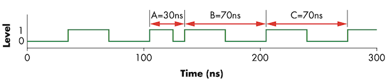<figcaption>
<em>Figure 4.2: Causing a fault in a CPU with a fast cycle</em>
</figcaption></figure>

A clock with a period of 70ns is interrupted by cycle A, which is shorter than normal. Cycle B starts only 30ns after the beginning of cycle A, and the duration of B and C is 70ns. This interruption could potentially cause a malfunction in the chip during cycles A and/or B.

Timing precision is crucial in dealing with GHz clock speeds, where a nanosecond jitter can make a significant difference as it equals a full clock cycle at 1 GHz. Building specialized hardware circuits is necessary to achieve this level of timing precision in practice, particularly for fault injection.

To achieve effective fault injection, it is essential to have control over various aspects of the injection process. A programmable injector allows for greater control and flexibility in setting fault parameters, which require multiple experiments to identify the optimal settings.

### **Target Preparation and Control**

The process of preparing a fault injection varies depending on the target and the type of fault to be injected. However, common actions include sending a command to the target, receiving results from the target, controlling target reset, triggering, monitoring, and performing fault-specific modifications. Figure 4.3 provides an overview of the connections involved in the process.

<figure>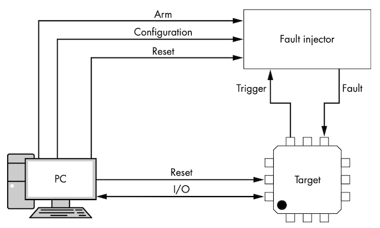<figcaption>
<em>Figure 4.3: The setup between PC, fault injector, and target</em>
</figcaption></figure>

In Figure 4.3, the fault injector is the physical tool used to perform fault injection, assuming it can insert a fault in the target using clock, voltage, or other methods. The target triggers the fault injector to synchronize it, which typically goes directly to the fault injector tool as it has more accurate timing than routing the trigger through the PC. The PC controls the overall target communications and records various output data from the device. The interaction between the fault injector, target, and PC is critical, and understanding how they work together can help with timing considerations.

Figure 4.4 shows a typical sequence diagram that illustrates the interaction between the PC, fault injector, and target. The PC controls everything, and the fault injector and target communicate through it. The fault injector is connected to the PC via a standard interface, such as USB.

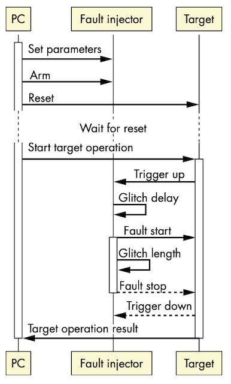

_Figure 4.4: sequence of operations involves a PC controlling a fault injector and target for a single fault injection attempt._

The fault injection sequence involves configuring the fault injector, waiting for a trigger event from the target, waiting for a glitch delay, inserting a glitch of glitch length, and observing the target operation's output.

### **Sending Command to the Target**

The target device needs to run a process or operation under the control of a script via various communication channels, and sometimes starting the target operation can be as simple as switching on the device, such as in the case of OpenSSH where connecting to the SSH daemon over the network starts the password verification operation.

### **Receiving Results from the Target**

To determine if an injected fault has produced interesting results, target communication should be monitored for any codes, statuses, or signals that could be relevant to injection and record all information from the communication channel at the lowest possible level.

When monitoring target communication for interesting results, it's important to capture all information, including any unusual data that may not adhere to normal communication protocols, and avoid any protocol parsers that may interfere with capturing device faults. In the case of network-based targets like OpenSSH, sniffing all network traffic from the target is recommended over relying on SSH client logging.

### **Controlling the Target Reset**

To reset the device into a known state after crashing during experiments, one can pulse a reset or line button for a warm reset, or do a cold reset by dropping the supply voltage of the core long enough to cause a clean reset (don’t do it too fast, you may cause a fault - which we don’t want). The host control code should anticipate and handle any issues that may arise, such as both ends of a communications channel crashing, and in the case of the OpenSSH example, the OpenSSH server should automatically restart upon reset.

### **Controlling a Trigger**

Triggers are electrical signals from the target which can be used to synchronize with the fault injector. Using a stable trigger programmed on the target's external pins (GPIOs, LED, Serial Ports) makes it easier to inject faults at the right time. The trigger pin is pulled high before the target operation, and the fault injector waits an adjustable delay before injecting the fault. This provides a steady reference point for timing.

<figure>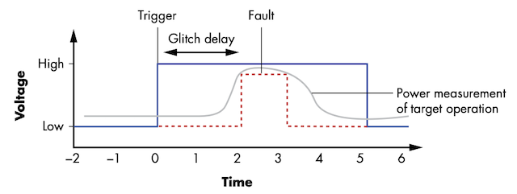<figcaption>
<em>Figure 4.5: Overview of target operation, trigger, and fault timing</em>
</figcaption></figure>

The power consumption of the target operation is measured with an oscilloscope and represents the operation, while a pulse represents the trigger, and a pulse created for the fault injector represents the fault timing and amplitude. However, clock jitter on the target may cause the operation to occur at unpredictable times, reducing the fault's success rate.

To characterize a device accurately, explore if it has non-constant timing in execution, as jitter can come from unexpected sources. An **Instruction Synchronization Barrier** (ISB) instruction can be used to clear the context before executing trigger code to solve the issue of small cycle differences due to context-dependent instruction delay.

If hardware triggering is not available, software triggering is a fallback option. This involves sending a command to start the operation, performing a precise delay, and then initiating the fault injector by sending a software command. However, this software solution suffers from all the jitter of software control, which decreases the ability to reliably reproduce the fault.

### **Monitoring the Target**

To debug the setup, monitoring the target, communication, trigger, and reset lines is necessary using a logic analyzer or oscilloscope. Before injecting faults, run some target operations and capture the communication, trigger, and reset lines to ensure they're working properly. Side-channel capabilities can also be used to monitor target behavior and identify jitter between the trigger signal and operations being executed. Finally, running a few trial faults helps determine if everything continues to run as expected.

When monitoring, it's important to remember that the measuring process itself affects the target in the analog domain. Having a scope hanging off the VCC line can absorb the voltage glitch and change its shape. To avoid this, use a high impedance and a 10:1 probe when keeping the scope connected. Before starting fault injection experiments, ensure that everything is working properly and remove all temporary monitoring to avoid interference with the results. Simple setup instabilities, or OS updates can interfere with the experiment.

Planning, programming, and building all the components of the attack robustly increase the effectiveness of fault injection experiments. The setup should be able to run for weeks and withstand any unexpected situation that may arise.

## Fault Searching Methods

To inject faults successfully, we need to determine the type of faults the target is sensitive to and experiment with various parameters to find a winning combination. The approach involves basic target analysis, feedback, and some luck. We can use experiments and test programs to narrow down the target's sensitivities, rather than assuming what sort of faults and parameters would be successful. A clock glitching example will be presented to illustrate how to find parameters, and we will also explore search strategies for traversing the fault parameter search space.

### **Discovering Fault Primitives**

The goal is to discover fault primitives and associated parameter values in a programmable target to learn its weaknesses. Fault primitives are the type of effect an attacker has on the target when injecting a specific fault, such as inducing a skipped instruction or changing specific data values. Tests can help investigate and tune the setup to predict the results that can be induced.

Balasch’s Paper “An In-Depth and Black-Box Characterization of the effects of clock glitches on 8-bit MCUs” is a great reference.

**Loop Test**

<figure>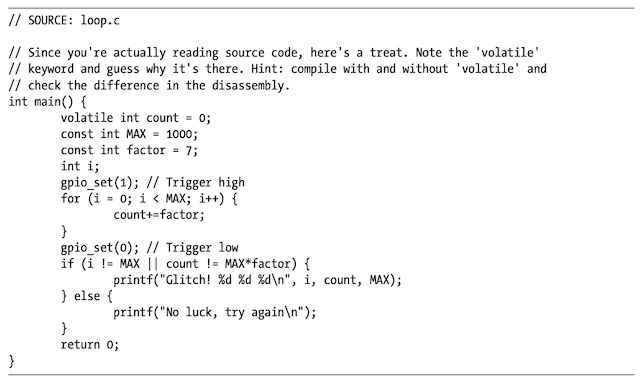<figcaption>
<em>Snapshot 4.1: A Simple Loop Example</em>
</figcaption></figure>

The program should produce a count that is factor times n at the end, and if not, a fault has occurred. Based on the output, the fault can be identified by reasoning about what happened. Skipped operations can result in counts that are too high or too low, and corrupting the end check can result in a count that is a factor of seven but much lower than expected. Registers may also get swapped on a fault, resulting in garbage values, so it may be helpful to dump all CPU registers.

**Register or Memory Dump Test**

The test described aims to see if memory or register values in a CPU can be affected by injecting faults. To do this, a program is created to dump the register state or memory to establish a baseline, and another program is created to raise a trigger, execute a nop slide (a large number of sequential “no operation” instructions in the CPU), lower the trigger, and dump the register state or memory again. A fault is then injected during the nop slide's execution to see if any memory or register content has changed by dumping it or comparing the hash. The test involving EM pulses can help in identifying the **physical location** of a fault in RAM cells or registers and their corresponding **logical location**.

**Crypto Test**

A crypto test is when a cryptographic algorithm is run multiple times with the same input data. Most algorithms produce the same output when given the same input. However, the Elliptic Curve Digital Signature Algorithm (ECDSA) generates different signatures each time it runs. If there is an output corruption, it may be possible to execute a differential fault analysis attack to recover key material from the faulty algorithm.

**Targeting a Non-Programmable Device**

When targeting a non-programmable device, there are two options to determine the fault primitive: 1- use a similar programmable device and hope the fault primitives are similar, or 2- use monitoring capabilities and deduction to shoot at the target device, such as using side-channel measurement to discover timing and a broad parameter search to determine further fault parameters.

### **Searching for Effective Faults**

The loop, memory dump, and crypto tests can help determine the type of fault that has occurred, but not how to induce an effective fault. To induce an effective fault, the target's basic performance parameters must be determined. This can provide a starting point for finding effective faults. Tuning the fault injector's parameters is then necessary to make the injection effective.

**Overclock Fault Example**

Suppose that you possess a target that comes with a loop test program and a clock fault injector connected to the clock line, as depicted in Figure 4.6.

<figure>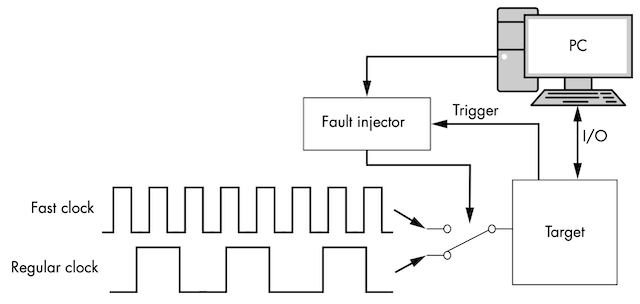<figcaption>
<em>Figure 4.6: Clock Switching Arrangement</em>
</figcaption></figure>

This workbench uses an electronic switch to alternate between two clock frequencies to induce a fault in the target device. The faster clock frequency is expected to cause the target device to fail. A microcontroller, acting as a clock fault injector, controls the switching and monitors the target device.

To induce a fault, there are various parameters that can be adjusted. These parameters can either cause no effect, a full crash, or a fault depending on the target. Parameters that can be adjusted include the frequency of overclocking, the number of clock cycles after the trigger to start overclocking, and the number of consecutive cycles to overclock. Other parameters that can be adjusted include high and low voltage, rise/fall times, and other complex aspects of the clock.

The code provided in Snapshot 4.2 demonstrates a method to carry out multiple experiments using varying settings.

<figure>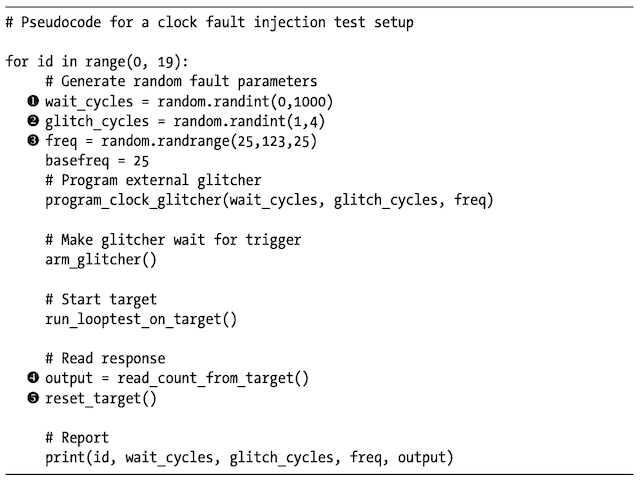<figcaption>
<em>Snapshot 4.2: A Python code to vary parameters and view the results</em>
</figcaption></figure>

The experiment involves using randomized settings for the (1) wait parameter, (2) glitch cycles, and (3) overclock frequency for fault injection attempts. (4) The program output is captured for each attempt before (5) resetting the target to determine if an effect has been caused. If the target is running the loop test with a factor of one, the counter increases by one every iteration, and if the output returned is anything other than 'FF FF' after looping 65,535 times, it indicates that a fault has been injected.

Figure 4.7 illustrates the order of actions among the fault injector, target, and PC for the example discussed earlier. It is useful to compare it with Figure 4.4 to observe the differences in the configuration used in this specific example.

<figure>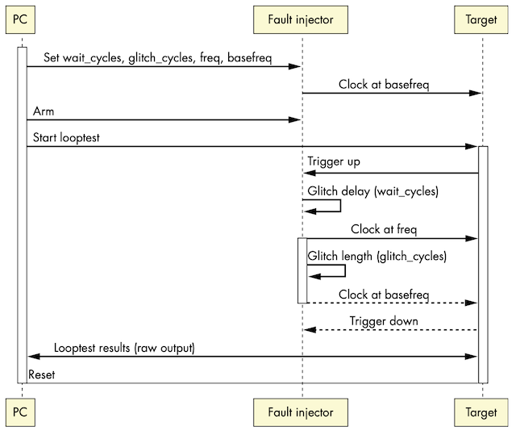<figcaption>
<em>Figure 4.7: Sequence of operations between PC, fault injector, and target when doing a single fault injection</em>
</figcaption></figure>

The configuration parameters passed to the fault injector tool specify that we are going from the basefreq to freq, as seen in Figure 4.7.

Figure 4.8 shows a snapshot of the signals on a logic analyzer, where the target block switches between basefreq and freq. The target clock runs at double speed when the fault injector is active, with a wait cycle set to 2 and glitch cycles set to 3. By counting the cycles, we can see the transition from the rising edge of the trigger signal to the time when the target clock increases to freq. As different parameters are tried, the sweep through various settings can be observed.

<figure>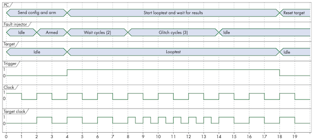<figcaption>
<em>Figure 4.8: Timing of operations between PC, fault injector, and target when doing a single fault injection</em>
</figcaption></figure>

Choosing the right parameter ranges is crucial for successful fault injection. If the ranges are too large, the attacker needs to be lucky to guess them all correctly to cause a fault. This approach is viable when there are a limited number of parameters, but as the number of parameters increases, the search space becomes exponentially larger, making it more difficult to find the right values.

To effectively induce a fault, it's best to narrow down the parameter ranges and isolate individual parameters. For example, if targeting the for loop in Snapshot 4.1, the wait cycles should be restricted within the trigger window measured by the loop's timing. Starting with small values and gradually increasing them until the target device crashes can help determine the boundary between "working" and "crashing" parameters. Then, searching for exploitable faults in that boundary can help induce effective faults.

**Fault Injection Experiment**

To conduct an experiment with the clock fault injector, specific parameter ranges need to be selected. The experiment will use a range of one to four glitch cycles, with one cycle as the minimum and four cycles as the maximum. The maximum setting is still considered gentle, as dozens or even hundreds of consecutive glitch cycles can crash the target. Additionally, the experiment will use an overclock frequency of 25 MHz to 100 MHz.

The process of running the fault injection program involves monitoring the output for any faults. If there are no faults, the parameters need to be adjusted to be more aggressive, while if there are only crashes, the parameters need to be adjusted to be less aggressive.

**Fault Experiment Results**

The first run of faults and their corresponding test parameters and output sent by the target to the PC are presented in Table 4.1.

<figure>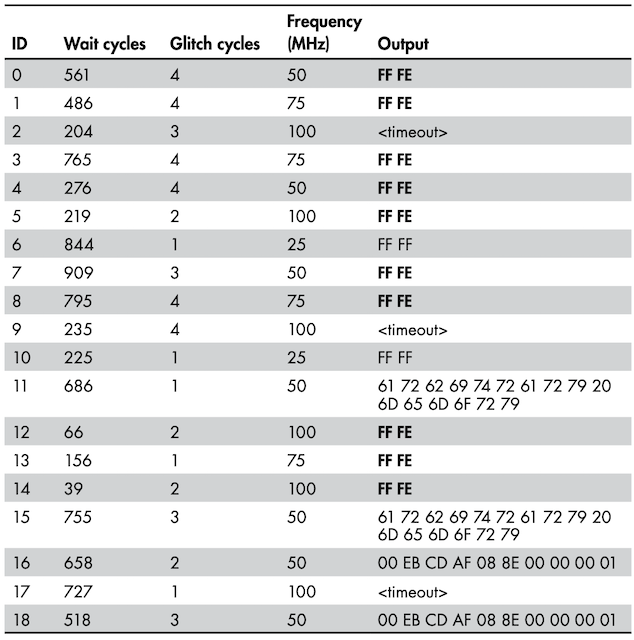<figcaption>
<em>Table 4.1: Results of the First Run of Faults</em>
</figcaption></figure>

The log from the experiment indicates that some attempts produced no faults, while others returned values that suggest induced fault primitive types. For instance, the output of FF FE indicates that a fault may have caused "skip a loop" or "turn an addition into a nop (no operations)." Additionally, some outputs are arbitrary data, which could potentially be useful for an attack if enough snippets of arbitrary memory are gathered (which can be translated to passwords or firmware contents leakage). A timeout occurred as well, which suggests that the target crashed and stopped responding.

**Analyzing the Results**

The data in Table 4.1 shows that faults were induced with clock frequency between 50 MHz and 100 MHz during glitch cycles 1-4. At 25 MHz, no faults were observed. The output of FF FE indicates fault primitive types such as "skip a loop" or "turn an addition into a nop". Corruptions were observed at 50 MHz and timeouts at 100 MHz. At 75 MHz, "skip a loop" primitive fault type was consistently observed regardless of the number of glitch cycles, and wait cycles had no effect. Further analysis will be conducted to narrow down the parameter ranges that induce the desired results.

**Retrying the Experiment**

The results of the initial experiment suggest that a more targeted range of parameters should be investigated for the "skip a loop" primitive. The successful faults at 75 MHz provide a good starting point, with an average of 550.5 wait cycles and 3.25 glitch cycles. However, running tests with these ranges of parameters did not result in any faults. To explore other options, the frequency is fixed at 75 MHz and the original ranges of wait and glitch cycles are used for a new set of tests.

<figure>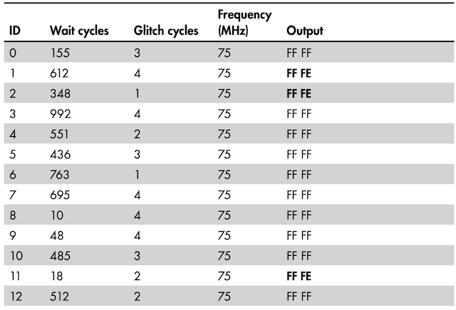<figcaption>
<em>Table 4.2: Examples of Glitch Results, Take Two</em>
</figcaption></figure>

After analyzing the results of the second experiment, it appears that any number of glitch cycles can cause faults, so the issue must be with the wait cycles. The wait cycles refer to the number of clock cycles between the trigger and the fault attempt. If only one instruction in the for loop is vulnerable to a fault, then wait cycles that are **multiples of three** seem to result in the FF FE fault. The number of glitch cycles does not seem to affect the fault, which is odd since starting one cycle before the vulnerable instruction with a glitch cycle of two should hit the vulnerable instruction and cause the same fault. However, the ways of hardware are often mysterious, and it is best to accept the black magic aspect of fault injection in such cases.

**The Outcome**

The experiment was able to establish that a loop can be skipped or an increment instruction can be turned into a nop by hitting the right clock cycle. The wait cycles were set to a multiple of three based on the limited experiment, which resulted in five successes and one failure, giving an estimated 83 percent success rate.

Additionally, it is worth noting that fault injection is not always successful, and even when it is, the impact of the fault may not always be predictable or controllable. It is important to thoroughly test and validate any fault injection techniques before deploying them in a real-world scenario.

### Search Strategies

The process of selecting parameters for fault injection experiments is complex and there is no single recipe for finding the best parameters. It is important to consider the high-dimensional parameter optimization problem and the exponential increase in search space when adding more parameters. Randomizing parameters is generally ineffective and other strategies such as repeating sensitive computations or attempting multiple faults may introduce new parameters. Some general strategies for optimizing parameters include random or interval stepping, nesting, progressing from small to big, trying a divide-and-conquer approach, attempting a more intelligent search, or **exercising** **patience**.

**Random or Interval Stepping**

When choosing parameter values, one has to decide whether to use random values for each attempt or step through intervals in a specific range. Using random values for multiple parameters is useful when starting testing to sample various parameter combinations. Stepping through each value for wait cycles within a range is useful when other parameter values are already established and one wants to pinpoint the exact clock cycles that are fault sensitive.

**Nesting**

Nesting parameters is a way to try all values for some parameters exhaustively. The nesting order is the arbitrary choice of which parameter to sweep first and which to sweep next. For example, you can try all wait cycles for a fixed clock frequency first and then try all wait cycles for the next clock frequency. However, this approach can lead to an explosion of the number of combinations to test if the ranges are bigger. You may accidentally make your life more complicated if the target you are working with is very sensitive to a particular parameter value. In this case, you would be better off sweeping that parameter first and then changing the other parameters. Information about the sensitivity of the target to specific parameter values can be derived from an initial sweep using randomized parameter value selection.

**Small to Big**

The strategy of starting with small values for all parameters and then gradually increasing the range of parameter values is known as progressing from small to big. This method is considered safe as it can prevent catastrophic consequences that can occur when some faults are induced at high parameter values, such as a laser power being ramped up from a small spark to a full-blown puff of blue smoke. The parameters that can be set to small values include time, pulse intensity, and voltage differential.

**Big to Small**

The small-to-big method involves starting with small values for parameters and slowly increasing their range, which is a safe but time-consuming approach. In contrast, starting with high values and then reducing them slowly can be more effective but has a higher risk of destroying the target. However, the latter technique is useful during the initial setup of non-destructive fault injection methods to confirm that the fault injection circuitry is working correctly. For instance, voltage glitching can be used to cause device resets.

**Divide and Conquer**

The relationship between parameters varies - some are independent while others are dependent. It is advisable to identify and optimize independent parameters for maximum effectiveness. For instance, the pulse power for an EM fault is likely to be independent of the timing of a critical program instruction. To determine the right EM power parameter, you can randomize the fault timing and gradually increase the EM power until crashes or corruptions occur. After identifying the estimates for the EM power parameter, step through the program's instruction timing to discover an instant that produces a useful fault while leaving the EM power at that level.

Although some parameters may appear independent, they may still be interdependent. For example, a voltage glitch may require different strengths at different stages of a program due to varying power levels. If you have difficulty finding suitable parameters, try optimizing some parameter pairs simultaneously. Parameters like the x- and y-coordinates of the spatial location for an EM pulse injection and the clock speed and voltage glitch depth are probably interdependent. Optimizing them separately may result in missed opportunities for identifying good faults.

**Intelligent Search**

While randomizing or stepping can optimize some parameters, hill-climbing algorithms can be used to optimize others. These algorithms start with a set of parameters and make small changes to them to see if the performance improves in terms of the faulting success rate. For instance, for optimizing the location of a sensitive spot on a die, you can inject faults around the spot and move in the direction where the success rate increases until there are no more neighboring spots with increased success rates. This technique can be applied to all parameters that show smooth changes in success rates with small changes in the parameters. However, it fails when such smooth changes are absent.

**Exercising Patience**

While waiting for an experiment to complete is not very efficient, it can sometimes be the most effective approach. Finding the right combination of parameters to induce a fault can be challenging, so don't give up too easily. If you have exhausted all intelligent parameter-searching techniques in the lab, you can let the experiment run for weeks to search for lucky parameter combinations.

### **Analyzing Results**

To interpret the results effectively, one can present them visually by sorting the results table by the parameter being investigated and color-coding each row based on the measured result. Clustering of results can help identify sensitive parameters. Interactive sorting enables drilling down to effective parameter sets. Figure 4.9 provides an example of colored lines to represent results: green for normal, yellow for resets, and red for invalid or unexpected responses caused by faults.

<figure>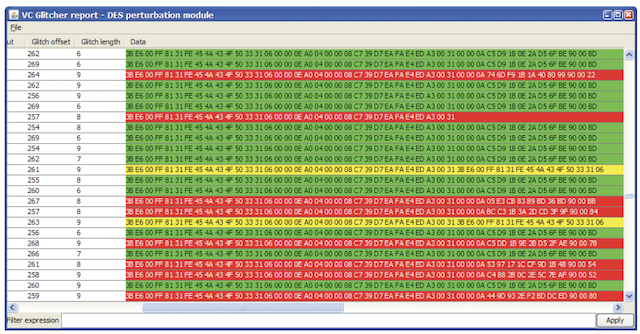<figcaption>
<em>Figure 4.9: Color-coded results in Riscure’s Inspector software</em>
</figcaption></figure>

For effective faults, determining the min/max/mode values for each parameter can be useful. Note that the statistical “mode” calculation yields more reliable results than the “average” statistical calculation, because the average could point to a parameter value that doesn’t cause faults. A good way to identify parameter values is to visualize the results on an x-y scatter-plot, where two different parameter variables are plotted along the two axes

<figure>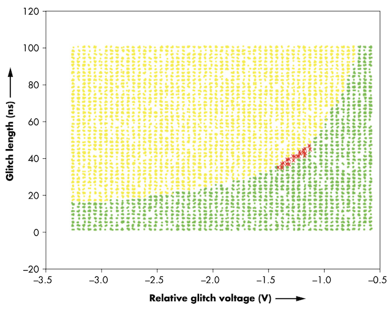<figcaption>
<em>Figure 4.10: Statistical Mode, with significant faults plotted with an X</em>
</figcaption></figure>

In an x-y scatter plot, data points generated by parameters that caused significant faults are marked with an X. These points cluster between the reset/crash data points plotted in the top-left lighter shade (yellow in the original software) and the bottom-right darker points (green in the original software) representing correct program behavior.
