# Information Gathering

## Information Gathering

Obtaining information is a crucial step that is necessary for any hardware or software hacking. The information gathered about a product or target can save a significant amount of time and effort by directing attention to the right areas. Information gathering is also referred to by other names such as doxing and recon. It is important to gather information from the model number rather than just the name, as device manufacturers often differentiate between first and second generations of their products.

### Federal Communications Commission Filings

The FCC, a US government agency, is responsible for regulating devices and components to prevent excessive interference with other signals. Similar agencies exist in other countries, but the FCC is particularly noteworthy due to the size of the US market and the fact that its database is accessible online.

### **FCC Filings**

Any device that emits radio waves is considered an intentional radiator and must meet FCC regulations. Manufacturers are required to test their devices and provide documentation of the results. These documents can be helpful in gathering information about a targeted device and saving time. Devices that are unintentional radiators must also have an FCC logo, but their testing reports are typically not available online.

To find FCC filings, the FCC website or a third-party site like [FCCID](http://fccid.io) can be used to search for the device's FCC ID, which is composed of a grantee code and a product code assigned by the company. The FCC provides information such as operating frequencies, external and internal photos, and detailed PCB photos, making it possible to learn a lot about a device without physically accessing it.

### **FCC Equivalents**

Other countries have regulatory agencies similar to the FCC, such as Industry Canada (IC), which issues IC codes that can be searched for. If the IC does not provide sufficient information, one can search for the grantee code in the FCC ID search as companies may have both IC and FCC codes.

### Patents

Patents allow a company to have exclusive rights to their product, enabling them to take legal action against anyone who copies their product's operation. Companies love patents because they safeguard their products from being replicated or designed by competitors. Patents require an explanation of the device's operation and design, which can also be beneficial for hackers.

#### **Finding Patents**

Certain devices may be stamped with "Protected by US Patent 7,324,123". This number serves as an identifier that can be searched online via the US Patent and Trademark Office ([USPTO](https://www.uspto.gov/patents/search)) or [Google Patent](https://patents.google.com/). In case you don't see a patent number, you can conduct a search for the company instead.

Some products are labeled with “Patent Pending” which means that the company is waiting for a patent approval, in this case device’s patent is probably not publicly viewable. Notice that for example, the patent is provided for the manufacturer of a chip not a specific device.

For patent pending devices, you would likely find a patent application, which doesn’t provide useful information, but using a system called USPTO Public Pair allows you to review all similarities between a USPTO and patent application.

### Datasheets and Schematics

To assist designers in using their components, manufacturers release datasheets, which can be made available publicly or under non-disclosure agreements. These documents function similarly to manuals for printed circuit board designers, but they typically do not include comprehensive schematics. Instead, designers can access publicly shared logical designs that illustrate how the various components are interconnected.

To locate datasheets and schematics, you can utilize websites such as [findchips](http://findchips.com/). Additionally, for surface mount device (SMD) marking code searches, you can use resources like [yooneed](http://smd.yooneed.com/) or [s-manuals](http://s-manuals.com/smd).

Datasheets for components can be identified through their part numbers, which consist of a series of seemingly random characters typically printed on the component itself. For instance, the datasheet for MT29F4G08AAAWP can be broken down as follows:

* MT stands for Micron Technology.
* 29F is the product family of NAND flash memory.
* 4G indicates a 4GB storage capacity.
* 08 indicates an 8-bit device.
* The First “A” means one die, one command pin, and one device status pin.
* The second “A” indicates an operating voltage of 3.3 V.
* The Third “A” is a listed feature set.
* WP indicates that the component is a 48-pin thin small outline package (TSOP).

## Opening The Case

Looking inside the PCB, Identifying the ICs and Component used is very helpful in order to understand how this device ticks, also, gathering each component’s datasheet to better understand it and how to communicate with it.

### Small Leaded Packages SOIC, SOP, QFP

Identifying an IC package is very useful when searching for datasheets, and also, the type of packaging can affect what attacks can be performed. Some very tiny packages provide almost chip-level access, also, probes are easier to use on these tiny packages.

<figure>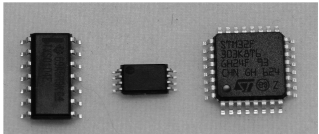<figcaption>
<em>Figure3.1: Small Leaded Packages: SOIC, TSSOP, and TQFP</em>
</figcaption></figure>

All of the packages shown above have leads on them, the difference appears in the relative size between leads and their locations. For instance, both Thin Quad Flat Pack (TQFP) and Plastic Quad Flat Pack (PQFP) have almost similar pin pitches, counts, and sizes.

The largest package called Small Outline Integrated Circuit (SOIC) usually has pins on two sides and a pin-to-pin spacing of 1.27mm, which is convenient in case of using grabber clips on it. (Most SPI flash memory chips are in 8-pin or 16-pin wide SOIC packages)

Smaller versions of SOIC are the Small Outline Package (SOP), Thin SOP (TSOP), and Thin-shrink SOP (TSSOP). All of these also have two edge pins, with a pin-to-pin spacing of 0.4mm to 0.8mm. The wide version of TSOP packages comes with 48 pins and is usually used for parallel flash memory chips.

<figure>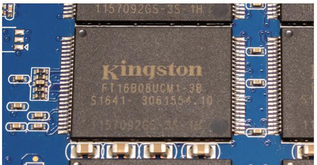<figcaption>
<em>Figure3.2: A 48-pin TSOP Package</em>
</figcaption></figure>

Finally, the Quad Flat Pack (QFP) package has four leads on all four edges, also, as seen in the Thin QFP (TQFP) or Plastic QFP (PQFP) packages, the differences are in the material or the thickness.

The Pin-to-Pin spacing is usually between 0.4mm and 0.8mm. The internal construction of TQFP has a small central IC die which is connected to a lead frame as shown below.

For sanding off sections of any IC, you can use either **sandpaper** or **acid decapsulation** to keep things more intact.

<figure>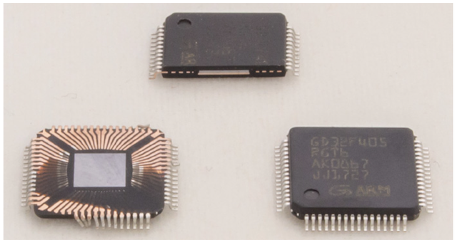<figcaption>
<em>Figure3.3: QFP Package</em>
</figcaption></figure>

<figure>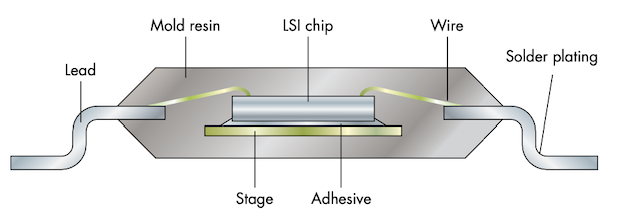<figcaption>
<em>Figure3.4: Internal Construction of SOIC/SOP/TQFP packages</em>
</figcaption></figure>

### No-Lead Packages: SO and QFN

No-lead packages are similar to the previous SOIC/QFP packages, but instead of leads, a pad underneath the chip is soldered onto the PCB. This pad often extends to the edge of the device.

<figure>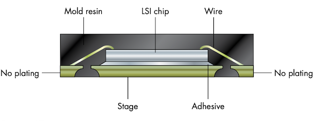<figcaption>
<em>Figure3.5: No-Lead Package</em>
</figcaption></figure>

The Small Outline No-lead (SON) package has connections on two edges and a central thermal pad underneath it, which requires hot air to solder or remove. The WSON package is wider and has a 1.27 mm pitch, commonly used for SPI flash memory chips. The Quad Flat No-lead (QFN) package has connections on four edges and a thermal pad in the center, widely used for various devices such as microcontrollers and power-switching regulators. All of these packages have typical pitches in the 0.4 mm to 0.8 mm range.

### Ball Grid Array

Ball Grid Array (BGA) packages have balls on the bottom of the chip, so, you won’t be able to see them from the top.

<figure>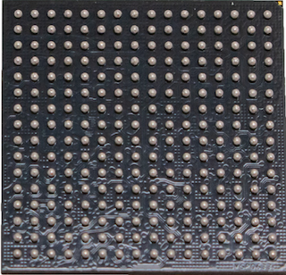<figcaption>
<em>Figure3.6: BGA Package</em>
</figcaption></figure>

BGA is frequently used in SoC, main processors, eMMC, and Flash devices. Smaller BGAs on the side of the main processor are often DRAM chips in more complex systems.

There are several variants of BGA devices including:

### **Plastic and Fine Pitch BGAs**

Plastic BGA (PBGA) devices usually have a 0.8mm to 1.0mm pitch, The chip is internally bounded to a carrier board that has the solder balls on it. Fine Pitch BGA (FPBGA) is similar to PBGA but with a finer grid of 0.4mm to 0.8mm.

<figure>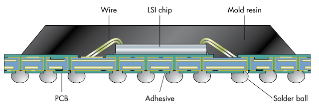<figcaption>
<em>Figure3.7: Plastic PGA</em>
</figcaption></figure>

### **Thermally Enhanced Ball Grid Array**

TEBGA has a metal area for heat spreading, which provides a better thermal connection to both the bottom solder and the heatsink mounted on top of the package.

<figure>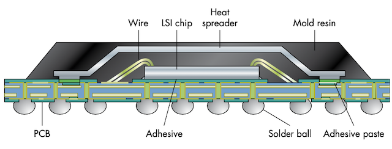<figcaption>
<em>Figure3.8: Thermally enhanced BGA</em>
</figcaption></figure>

### **Flip-Chip Ball Grid Array**

Flip-Chip BGAs (FC-BGAs) are a type of BGA package that eliminates internal bond wires by soldering the chip directly onto the carrier PCB. The internal LSI chip is placed upside down, with the top metal layer on the bottom and small solder balls mounted on it. FC-BGAs may also have integrated passives, such as decoupling capacitors. Removing the heat spreader or "lid" allows closer access to the actual chip for fault injection or side-channel analysis

<figure><figcaption>
<em>Figure3.9: FC-BGA</em>
</figcaption></figure>

### **Chip Scale Packaging**

Chip Scale Packaging (CSP) is a small packaging method where a sawed-off piece of a chip wafer is used without an encapsulant on the top side. The device is typically connected to a PCB using fine-pitch balls on the bottom and may be referred to as Wafer-Level CSP (WLCSP). CSPs are similar to the LSI chip part of Flip-Chip BGA and have a very small pitch, usually 0.4 mm or finer, and can be easily distinguished from regular BGAs.

<figure>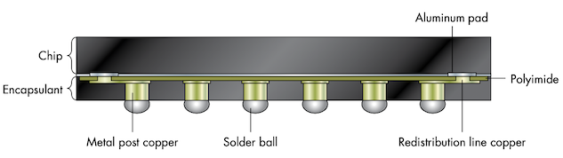<figcaption>
<em>Figure3.10: CSP Internal Structure</em>
</figcaption></figure>

## Identifying Components on PCB

### **Ports**

Ports can be used to make connections to a device and understand the function of its components. Digital I/O ports are particularly interesting because they can be used for device communication or debugging. Identifying the port type and protocol can be done by appearance, using an oscilloscope to measure voltages and data patterns, or tracing PCB lines to an IC and using its pinout information. The bitrate of the port can be determined by measuring the shortest pulse and taking the inverse, and rounding to a standard baud rate.

For instance: an 8.68 microsecond pulse translates into a 115,200 bitrate, we made that calculation by taking the inverse, 1 / 0.00000868 = 115.207

### **Headers**

Headers, which are internal ports, can provide access to functionality that is not intended for normal users but is included in the design for debugging, manufacturing, or repair. Headers may include JTAG, UART, and SPI/I2C ports, among others. Sometimes headers are not installed on the PCB, but their solder pads are still present, making it possible to gain access with some simple soldering. The figure below shows an example of several surface-mount headers.

<figure>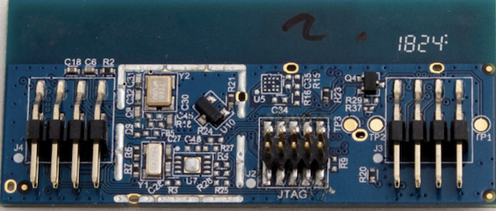<figcaption>
<em>Figure3.11: PCB Headers "JTAG"</em>
</figcaption></figure>

The middle header is marked JTAG and was not initially mounted on the PCB. By soldering it onto the pads, JTAG access to the main IC was obtained since the IC did not have memory read-out protection enabled. The header is identified as an Ember Packet Trace Port Connector.

Through-hole headers are easier to probe, while smaller devices may require a surface-mount header. Figure 3.12 shows a classic UART header inside a device.

<figure>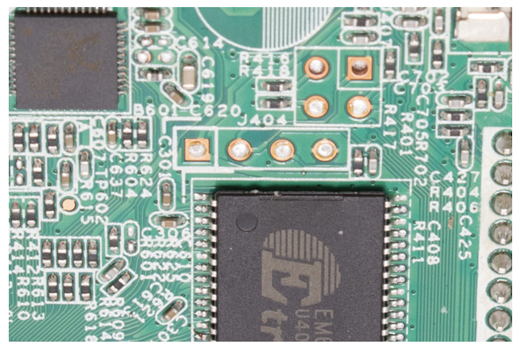<figcaption>
<em>Figure 3.12: A UART header in a device</em>
</figcaption></figure>

The four pins in a row marked with "J404" on the board are the JTAG header, and there is no standard pinout for it. To identify the pins, reverse engineering must be performed, but the left pin is visually connected to the larger ground plane and can be confirmed with a multimeter.

### **Analog Electronics**

Most small components found in electronics are analog electronics, such as resistors and capacitors. Other components, like inductors, oscillators, transistors, and diodes, can also be found as SMDs. Capacitors, like C31 in Figure 3.13, can store and release small bits of charge and are often used to filter a signal.

They act like very fast and small rechargeable batteries that can charge and discharge millions of times per second, creating a "low-pass filter" effect.

Decoupling capacitors are used around ICs and serve as a localized power source for the IC, preventing electrical noise from being injected into the power line and keeping noise from other areas from reaching the IC. Decoupling capacitors are shown to undo the effects of Voltage Fault Injection. Therefore, we first remove as many decoupling capacitors as we can without letting the system become unstable.

<figure>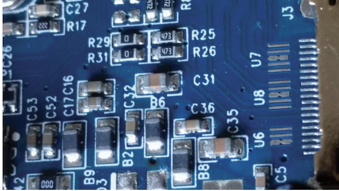<figcaption>
<em>Figure3.13: SMT Resistors and Capacitors</em>
</figcaption></figure>

Resistors can function as shunt, pullup/pulldown, and zero-ohm resistors. Shunt resistors are used to measure the current through an IC during side-channel analysis.

Zero-ohm resistors are essentially wires and can be used to configure a board at manufacturing time, such as selecting between boot modes. They are easily removed or created, so they can change security-sensitive configurations. Solder blobs can simulate a zero-ohm resistor.

The package size markings indicate the physical size of the resistor or capacitor, Surface Mount Resistors have a number printed on them to indicate the resistance value; abc refer to ab \* 10^c ohm resistance.

SMT components can be as small as 0201 (0.2mm x 0.1mm) as technology improves and devices get smaller.

### **PCB Features**

Jumpers and test points are interesting features found on PCBs. Jumpers are used to configure a PCB by opening or closing them like zero-ohm resistors. They can provide access to security-sensitive configurations and look like headers with removable connectors.

Test points are used for testing and debugging and are typically labeled with a test point identifier. They can be used to probe signals with oscilloscopes or logic analyzers.

Figure 3.14 shows the pads where a jumper header labeled JP1 could be installed.\
Figure 3.15 shows exposed traces that can be probed with a pogo pin or oscilloscope probe.

.png>).png>)

Test points are used for accessing specific PCB traces during manufacturing, repair, or debugging. They can be a simple pad on the PCB, a header or connector, or an exposed metal component that can be probed with an oscilloscope.

## Mapping The PCB

The process of reverse engineering a PCB involves identifying the circuit design from the physical product. This is useful for accessing certain signals on an IC, identifying the pinout of a header on the PCB, and targeting a certain power supply net for fault injection and power analysis.

The PCB is made up of conductive material, isolating material, and components, and consists of several layers of electrically isolated traces and vias (an electrical connection between different layers of a printed circuit board) that connect to other layers. Components are typically located on the front and back of the PCB.

<figure><figcaption>
<em>Figure3.15: PCB Traces and Vias</em>
</figcaption></figure>

The outer sides of a PCB have printed markings called the silkscreen which identify components, company logos, PCB part numbers, and other artwork.

The silkscreen is helpful when relating a PCB schematic to an actual PCB and can also help in identifying a specific component among many labeled ones. Pin 1 of an IC chip is usually identified on the silkscreen and on the IC package itself with a dot.

* C = Capacitor
* R = Resistor
* JP = Jumper
* TP = Test Point
* U = IC
* VR = Voltage Regulator
* XTAL or Y = Oscillator (Crystal)

To follow PCB traces, a multimeter set to measure resistance is commonly used. However, all traces are covered in a non-conductive solder mask, so it must be scraped off to expose the copper of the trace.

The multimeter measures resistance by applying a small current and measuring the voltage across the probes (V = IR), which can only be done on unpowered circuits as any voltage present can damage the multimeter.

PCB traces carry I/O signals and can form power and ground planes. When using a multimeter to follow traces, certain types of parts can confuse the meter, such as large capacitors which may appear as shorts. Semiconductor components may also read as a low resistance in one direction, so suspicious measurements should be double-checked. A direct short (0 Ω) is a "real" connection, and higher resistance values may be artifacts of the circuit elements.

Pullup or pulldown resistors are often connected to IC pins, but they are not the final destination of the net, so further probing is needed.

Ground nets are usually the ones with a lot of connections, and they are usually connected to at least one pin of a connector or metal casing of ports. Bigger ICs may have multiple ground pins, including separate analog and digital ground pins to reduce noise caused by digital switching. Ground can usually be found at metal cases on ports or marked by the text GND on the silkscreen.

Sometimes the metal cases on ports (normally called the shield) don’t connect directly to the digital ground, so always do a quick sanity check between some potential ground points before you dive too far in.

The PCB can have one or many power planes, each typically providing different voltages to components, particularly to the larger ICs. Common voltages that may be identified by text on the silkscreen are 5 V, 3.3 V, 1.8 V, and 1.2 V.

Voltage regulators and power management ICs (PMICs) are used to generate stable voltages from raw voltage. Voltage regulators convert raw voltage into a stable voltage, while PMICs are more complex and can be instructed to switch various voltages on or off.

PMICs may communicate with the SoC they are powering via a protocol like I2C to adjust the voltage based on the system's needs. Voltage drops can occur along traces when conducting high currents, so feedback circuitry to the PMICs is used to verify the voltage arriving at components and adjust the voltage if necessary.

In some cases, it may be necessary to bypass the PMIC and provide your own power source, but this can be tricky as the PMIC may go through complex voltage sequencing during boot and operation. However, in practice, there are rarely any issues with just supplying a constant voltage. It's important to keep the feedback loop intact and substitute your own independent power supply only to the IC you are investigating.

**Q\&As Mentioned:**

* At what voltage level is the IC or I/O channel running?
  * Power on the device and measure the steady voltage between ground and the relevant IC pin or on the PCB trace nearby.
* What is the ground plane connected to?
  * The metal casing of any port is going to be ground. You can use that as a reference, and after removing power from the device, identify all other ground points, on IC pins and connectors, by performing the beep test.
* How is power distributed on the PCB?
  * You can either measure voltages on all pins, as before, or use the beep test to identify all points connected to the same power plane.
* What are the JTAG pins connected to?
  * Let’s say you’ve identified the JTAG pins of the IC, but you want to know to which header or test point they are connected. Use the beep test between a JTAG IC pin and all “suspect” points on the board. If you really want to go pro, take a wire and fray one of the ends into a “fan” Connect one of your probe pins to the wire and “sweep” the board, which is much more efficient than having to touch every point manually.

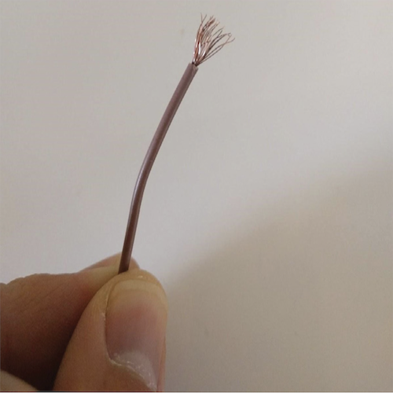

_Figure3.16: Sweeper made of a cable_

> 📖 PCB-RE: Tools & Techniques Book by Ng Keng Tigon

### JTAG Boundary Scan Mapping

Boundary Scan Uses a chip to drive a signal on a board and use measurement equipment to find out where that signal is routed, Also, Can be used to sense signals on a chip’s pin.

The process of using JTAG boundary scan for reverse engineering requires powering up the board and having access to a JTAG header. It also requires a JTAG Boundary Scan Description Language (BSDL) file and the device in question to have JTAG boundary scan enabled. This technique is typically used after basic reverse engineering has been done.

As an example, testing BMW E82 ECU which uses NXP MPC5676R device. The BSDL file for the MPC5676R chip can be found through an online search. This makes it worthwhile to attempt connecting a JTAG interface to the chip. An unmounted 14-pin header on the board is found, which resembles the commonly used 14-pin JTAG. A header is attached to this and a JTAG adapter is connected. This process is illustrated in Figure 3.17.

<figure>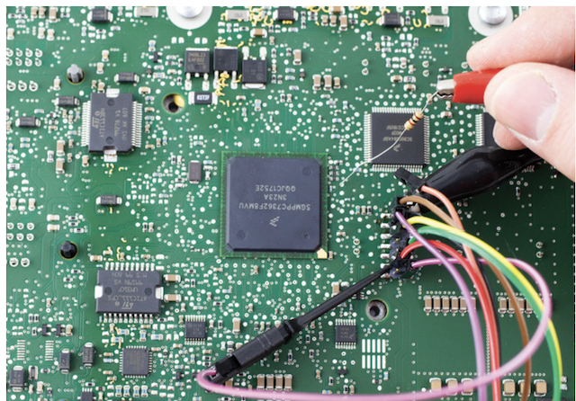<figcaption>
<em>Figure3.17: JTAG Header connected to E82 ECU</em>
</figcaption></figure>

After connecting the JTAG interface, the TopJTAG software is used to load the BSDL file and put the chip in EXTEST mode, which provides complete control over the chip's I/O pins. While there is a risk of causing damage by accidentally manipulating pins, using EXTEST mode avoids potential issues. The SAMPLE mode may not be effective as the chip is still running and driving outputs high or low.

<figure>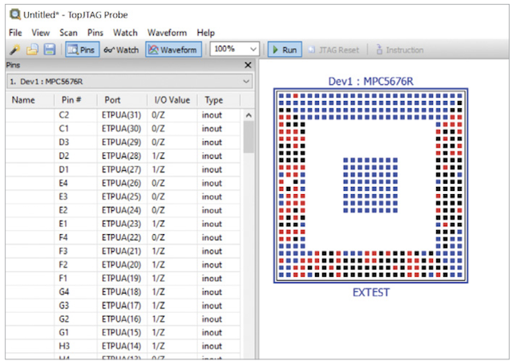<figcaption>
<em>Figure3.18: TopJTAG software</em>
</figcaption></figure>

Figure 3.18 shows a live view from **TopJTAG** of the state of each pin on the device, which changes in real time if the external voltage on the pin changes.

To map a test point to a pin, a square wave can be driven onto the board using a signal generator, and the associated pin should toggle on the TopJTAG screen. Alternatively, a 1 kΩ resistor can be connected to a VCC point on the board, and the other end can be tapped on the test point.

The software can also be used to toggle a signal from a pin and measure where that pin is connected on the board. Tools such as Joe Grand's **JTAGulator** can be used to automatically map test points to boundary scan bits.

## Firmware Information Extraction

Firmware images are essential for finding a point of attack since they contain most of the code running on a device. Analyzing firmware is a crucial step towards the overall goal of information gathering.

The rest of that section discusses many operations that depend on firmware, such as finding cryptographic signatures, which is important for knowing where fault injection can be applied. Understanding the code that references a signature is a good sign that you can find the location of the signature check routine.

### Obtaining the Firmware Image

To obtain the firmware image, the first step is to check if it can be downloaded from an update website or is available in the `/lib/firmware` directory for devices with Linux support. If the image is available as a separate file for download or embedded in an installer package, the next step is to use software reverse engineering skills to find the update file in the installation directory. One way to do this is to perform a plain string search for a known string that the device prints out. Another way is to use binwalk to find compressed images inside files. Lastly, one can perform the update and sniff the image off the communication channel during a firmware update with tools like **`Wireshark`** for Ethernet connections or **`socat`** for Linux.

The USB Direct Firmware Update (DFU) standard allows downloading and uploading firmware images to and from a device, and some devices support it.

DFU mode can be enabled as an alternative boot mode through a jumper or automatically chosen if the onboard firmware image is corrupted. Fault injection can corrupt the image-loading process, making DFU mode accessible to upload (extract) the firmware image. The [DFU-UTIL](https://github.com/Stefan-Schmidt/dfu-util) tool can perform this if it supports the device and if the device supports uploading.

Some devices, such as iPhones and iPads, have their own “proprietary” DFU mode in addition to the standard USB Direct Firmware Update (DFU) mode. The proprietary DFU mode runs immutable ROM code that allows for re-flashing the device over USB, but it does not implement the USB standard DFU mode.

The next method for obtaining firmware is hardware-based, where the firmware can be extracted from an external flash chip.

This process requires desoldering the chip from the board and using a memory reader to extract the firmware image. The [**FlashcatUSB**](https://flashcatusb.com/) series is a recommended option for minimal hassle. Other methods involve using Arduino or Raspberry Pi devices, or a DIY approach as described in "Reverse Engineering Flash Memory for Fun and Benefit" presentation from Black Hat 2014.

However, for some SoCs with internal flash chips, accessing the firmware is only possible through chip-level reverse engineering and microprobing after decapping, which is beyond the scope of this book.

To read eMMC chips onboard, you can use an SD card interposer connected to GND, CLK, CMD, and D0. These chips -Thanks to backward compatibility- are essentially SD cards in a chip form and can be run in 1-bit mode.

<figure>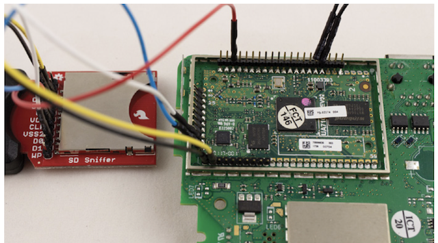<figcaption>
<em>Figure3.19: eMMC Flash Connections with SD Card Reader Pins</em>
</figcaption></figure>

Figure 3.19 shows how to read eMMC chips using an SD card interposer. By holding the target processor in reset and plugging the SD card into a USB SD card reader, the filesystem on the SD card can be mounted on a computer. For more information on this method, refer to the talk "Hardware Hacking with a $10 SD Card Reader"

### Analyzing the Firmware Image

The task after obtaining the firmware image is to analyze it by dissecting it into its components, including various stages of the bootloader, digital signatures, key slots, and a filesystem image.

Binwalk is a useful tool for finding all components and recognizing different sections by matching them against the “magic” bytes that encode different file types.

For encrypted data, the encryption used and the key need to be unraveled using side-channel analysis, and common options are AES-128 or AES-256 in CTR or CBC mode, although ECB and GCM have also been used. Once the key is obtained, the image can be decrypted for further analysis.

Binwalk Abilities:

* Detecting different files and compression methods. `--signature`
* Extracting components recursively. `—-crave, —-extract, —-dd, and —-matryoshka`
* Analyzing CPU architecture `—opcode or —disasm`
* Searching for strings. `—-raw`
* Analyzing entropy and compression ratio. `--entropy / --fast`
* Performing hexdump and diffing binary files. `--hexdump`
* Finding compressed data with missing headers using brute force. `--deflate or --lzma`

<figure>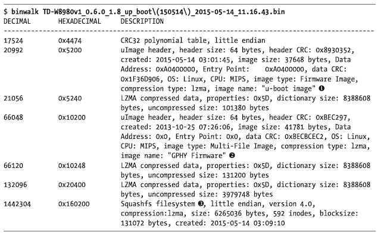<figcaption></figcaption></figure>

The output of running binwalk on the firmware image of TP-Link TD-W8980 router reveals the presence of a u-boot bootloader image (1), GPHY firmware (2), and a Squashfs filesystem (Linux) (3). Using binwalk with the --extract and --matryoshka options will extract these blocks as separate files with compressed and decompressed versions, and unpack the Squashfs filesystem.

The router uses an RSA-1024 signature to verify the authenticity of the firmware image. If a file on the Squashfs filesystem is modified, such as `/etc/passwd` or `/etc/vsftpd_passwd`, the router won't accept the new firmware image. The signature is not indicated in the binwalk output, so you have to find the offsets through entropy analysis.

### Entropy Analysis

In computer science, entropy measures information density, and for this purpose, we use 8-bit entropy. An entropy of 0 means a block of data has a single byte value, while an entropy of 1 means a block contains equal amounts of every byte value from 0 to 255. Entropy close to 1 is indicative of crypto keys, ciphertexts, or compressed data.

<figure><figcaption></figcaption></figure>

By running binwalk again with the `--nplot and --entropy` options, binwalk calculates the entropy for each block and determines block boundaries by looking for large changes in entropy.

In the case of the TP-Link TD-W8980 router firmware, the entropy analysis, as shown above, reveals that there is no block with an RSA-1024 signature, which is used to verify the image's authenticity.

### Signatures

To load modified firmware for signed data, one needs the signing key or a way to bypass signature verification. To check for data signing, we can modify a byte in the firmware image that won't cause execution to fail and see if the device fails to boot with the image.

RSA or ECC signatures can be looked for in the image, which are sequences of high-entropy bytes. Entropy spikes at the end or start of a block in the firmware may indicate a signature. However, reverse engineering may be required to find out which code is doing the signature verification.

To pinpoint when the execution path diverges during the boot, it is useful to check the difference between two side-channel traces: one where you boot with a correct signature and one where you boot with a corrupted signature. This can help identify the point at which the signature verification occurs and aid in bypassing signature verification using fault injection.

The firmware image may be shipped with the public key used to verify its integrity.

To find the public key in the firmware image, you can search for high-entropy sections. For RSA, the public key is the modulus and the public exponent, which is often 65,537 (or 0x10001). For ECC, public keys are points on the curve, which can be encoded in affine (x, y) coordinates or in a compressed notation.

A common encoding for a point is prefixed with 0x04 if it is uncompressed and 0x02 or 0x03 if it is compressed.

To secure the process of embedding a verification key with the object to verify, the public key's hash is typically stored in fuses. During boot, the hash is verified against the stored hash before the public key is used to verify the image. However, attackers can exploit this sequence by creating an image that embeds their own public key and sign the image with that key. They can then use fault injection to skip the key verification step.

>  The hash is stored in fuses instead of ROM because updating the ROM after a silicon mask is created is very expensive. Updating fuses during manufacturing is a matter of updating the manufacturing scripts, which is less expensive. This allows the same design to be used to create chips with different public keys.

Hash-based Message Authentication Code (HMAC) or Cipher-based Message Authentication Code (CMAC) are less common ways of signing a firmware image. These methods require distributing a symmetric key, which can be done either by embedding a root key into each device (Capable of verifying and signing arbitrary images) or by diversifying the symmetric keys per device and encrypting each firmware image with a **device-specific** key. The first option is not recommended, and the second option can be costly. However, the first option was used in the [**Philips Hue attack**](https://www.youtube.com/watch?v=56AHMMQ8-sk), so it's important not to assume that a product wouldn't use this method.
