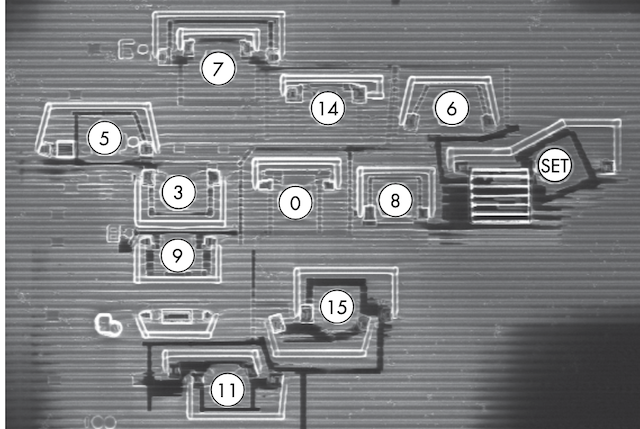

# Introduction

## Hardware Components

<figure><figcaption>
<em>Figure1.1: A PCB of an Embedded Device</em>
</figcaption></figure>

*   **Printed Circuit Board (PCB)**

    It is a board made of insulating material (usually fiberglass or plastic) with conductive pathways etched onto its surface. PCBs are used to mechanically support and electrically connect electronic components using copper traces that are etched onto the board.
*   **Central Processing Unit (CPU)**

    The Processor executes the main software and operating system, and SoC contains additional hardware peripherals, Usually implemented in Dynamic RAM
*   **Volatile Memory (RAM)**

    The Memory Used by the processor while it’s in action, its content are lost when the device powers down. Also, operates at frequencies close to the processor frequency and it needs wide busses in order to keep up with the processor.
*   **Non-Volatile Memory (EEP/ROM)**

    This is Where the embedded device stores data that needs to persist after power to the device is removed. This memory storage can be in the form of EEPROMs, Flash Memory, or SD card and Hard Drives. Non-Volatile memory usually contains code for booting and storing applications or data.
*   **Analog Components**

    The Analog Components Such as Resistors, Capacitors, and Inductors are the starting point for side-channel analysis and fault-injection attacks. Labels starting with “C”, “R”, or “L”.
*   **External Interfaces**

    External interfaces enable the System-on-a-Chip (SoC) to establish connections with the outside world.

## Software Components

### **Initial Boot Code**

The set of instructions a processor executes when it’s first powered on, Generated by the processor manufacturer, and stored in ROM. The main function of boot ROM code is to prepare the main processor to run the code that follows. Normally, it allows a bootloader to execute in the field, including routines for authenticating a bootloader or for supporting alternate bootloader sources. also, it is used for support during manufacturing for personalization, failure analysis, debugging, and self-tests. The features of the boot ROM are configured via **fuses**, which are one-time programmable bits integrated into the silicon that provide the option to disable some of the boot ROM functionality permanently when the processor leaves the manufacturing facility.

### **Bootloader**

The bootloader initializes the system after the boot ROM executes. Stored on nonvolatile but mutable storage, so it can be updated in the field. The PCB’s original equipment manufacturer (OEM) generates the bootloader, allowing it to initialize PCB-level components. it may also optionally lock down some security features in addition to its primary task of loading and authenticating an operation system or trusted execution environment (TEE). Being the earliest mutable code to run on a device, the bootloader is an attractive target to attack. Less-secure devices may have a boot ROM that doesn’t authenticate the bootloader, allowing attackers to replace the bootloader easily. Bootloaders are authenticated with digital signatures, which are typically verified by embedding a public key in the boot ROM or fuses. Because this public key is hard to modify, it’s considered the **root of trust.** The manufacturer signs the bootloader using the private key associated with the public key, so the boot ROM code can verify and trust that the manufacturer produced it. Once the bootloader is trusted, it can embed a public key for the next stage of code and provide trust that the next stage is authentic. This chain of trust extends all the way down to applications running on an OS.

### **Trusted Execution Environment (TEE)**

A rare feature in smaller embedded devices, very common in android phones and tablets, Creating a Virtual Secure SoC by partitioning an entire SoC into secure and non-secure worlds.

It is either exclusively active in the secure world or active in the non-secure world or is able to switch between the two dynamically. For instance, a SoC developer can put a crypto engine in the secure world and networking hardware through the non-secure world, allowing the system to encrypt network traffic in the secure world and transmit it in the non-secure world.

### **Firmware Image**

a low-level piece of software that runs on CPUs or peripherals. Simple peripherals in a device are often fully hardware-based, but more complex peripherals can contain a microcontroller that runs firmware controlling the peripheral.

### **Main OS Kernel and Applications**

The operating system in an embedded system can be a general-purpose OS, Such as Linux, or a real-time OS Like VxWorks or FreeRTOS. Smart Cards may contain proprietary OSs that run applications written in **Java Card.** These OSs can offer security functionality (e.g. Cryptographic Services) and implement **Process Isolation,** which means if one process is compromised, another process may still be secure.

Operating Systems make life easier, But for smaller devices, it will not be a viable option. Very Small devices may have no OS kernel but run only one bare-metal program to manage them, which usually **not implies** process isolation, so compromising one function leads to compromising the entire device.

## Types of attacks

### **Software Attacks on Hardware**

#### **Fault injection**

Fault injection is the practice of pushing hardware to a point that induces processing errors. A fault injection itself is not an attack: it’s what you do with the effect of the fault that turns it into an attack. Attackers attempt to exploit these artificially produced errors. For Example, they can obtain privileged access by bypassing security checks.

The Practice of injecting a fault and then exploiting the effect of that fault is called a fault attack.

#### **Side-Channel Attacks**

Software timing relates to the amount of wall-clock time required for a processor to complete a software task. In modern embedded systems it is easy for an attacker to measure the execution time, often down to the resolution of a single clock cycle. This leads to timing attacks, in which an attacker tries to relate software execution time to the value of internal secret information. For instance, the `strcmp()` function in C determines whether two strings are the same. It compares characters one by one, starting at the front, and when it encounters a differing character, it terminates. when using strcmp to compare an entered password to a stored password, the duration of strcmp’s finding the first non-matching character between entered and stored password. The strcmp execution time therefore, leaks the number of initial characters in the password that are correct.

#### **Microarchitectural Attacks**

Modern CPUs are optimized for speed, with caching and minimizing redundant calculations. However, these optimizations can reveal secret values, compromising security. **Spectre attack** uses speculative execution to manipulate the CPU cache and retrieve secret information through a timing attack.

Microarchitecture is the hardware implementation of an instruction set. Activating optimization related to a secret value may hint at values in the data. For instance, If the multiplication of N times K for an unknown K is faster, K could be 0 or 1.

A memory region accessed faster means it has been recently accessed. **Spectre** forces a CPU to perform a speculative operation that affects the cache based on some secret value and then uses a cache timing attack to recover the secret. We can use this trick in some existing or crafted programs to dump the entire process memory of a victim process. The larger issue at hand is that processors have been optimized for speed in this way for decades, and there are many optimizations that may be exploited similarly.

#### **PCB-Level Attacks**

The PCB is the initial attack surface for devices, so it’s important to learn as much as possible from the PCB design. The design provides clues as to where exactly to hook or better attack points in the PCB. For example, to reprogram a device’s firmware you need to identify the firmware programming port on the PCB.

Another Example of a PCB-level attack is taking advantage of SoC options that are configured by pulling certain pins high or low using **straps.**

The **straps** are Visible on the PCB as 0-ohm resistors, These SoC options may include debugging enablement, booting without signature checking, or other security-related settings.

<figure><figcaption>
<em>Figure1.3: Zero-Ohm Resistors R29, R31</em>
</figcaption></figure>

#### **Logical Attacks**

Logical Attacks Work at the level of logical interfaces, unlike PCB attacks it does not work at the physical level. Logical Attacks Aim at the embedded device’s firmware or software trying to breach the security without physical hacking. “Breaking into a house by realizing that the owner has a habit of leaving the back door unlocked”.

Famous Logical Attacks revolve around memory corruption and code injection, but logical attacks have a much wider scope. For example, if the debugging console is still available on a hidden serial port of an electronic lock, sending an “unlock” command may trigger the lock to open. or, if a device powers down some countermeasures in low-power conditions, injecting low-battery signals can disable those security measures.

Logical Attacks target design errors, configuration errors, implementation errors, or features that can be abused to break the security of a system.

#### **Debugging and Tracing**

Among the most powerful control mechanisms built into a CPU during design and manufacture are the hardware debugging and tracing functions. This is often implemented on top of a Joint Test Action Group (JTAG) or Serial Wire Debug (SWD) interface. Note: On Secure devices, Fuses, PCB Straps, or some proprietary secret code or challenge/response mechanism can turn off debugging and tracing. Perhaps only the JTAG header is removed on less-secure devices.

<figure><figcaption>
<em>Figure1.4: JTAG Headers</em>
</figcaption></figure>

#### **Fuzzing**

The technique known as fuzzing is utilized for the specific purpose of identifying security problems within code. Its main objective is to pinpoint crashes that can be exploited for code injection.

There are two types of fuzzing techniques: Dumb Fuzzing and Smart Fuzzing. Dumb Fuzzing involves sending random data to the target and observing its behavior, which can result in abnormal behavior or crashing for less secure targets. Smart Fuzzing, on the other hand, focuses on protocols, data structures, typical crash-causing values, or code structure, and is more efficient at generating corner cases that will crash a target.

There are two ways to perform fuzzing: Generation-based Fuzzing, which creates inputs from scratch, and Mutation-based Fuzzing, which modifies existing inputs. Coverage-guided Fuzzing is another type that uses additional data to find deeper bugs. High-speed fuzzing is crucial for effectiveness, with software fuzzing able to perform thousands to millions of cases per second.

However, this level of performance is challenging to achieve on embedded devices. A solution to this issue is firmware re-hosting, a technique that emulates a device’s firmware at low cost, resolving most of the problems associated with on-device fuzzing.

#### **Flash Image Analysis**

Most Devices include flash chips that are external to the main CPU. if a device is software-upgradable, you can find firmware images online. Once you’ve obtained an image, you can use various flash image analysis tools, such as binwalk, to help identify the various parts of the image, including code sections, data sections, filesystem, and digital signatures.

#### **Chip Noninvasive Attacks**

noninvasive attacks don’t physically modify a chip. Examples are Fault injection and side-channel analysis. Side Channel Attacks are used to do some measurements on the device’s power consumption to disclose secrets (For example Measuring a device’s power consumption to extract the AES key). a Fault Injection uses EM pulses to circumvent a security mechanism. For instance, a large EM pulse in a specific millisecond can disable a password verification test so that it accepts any password.

#### **Chip Invasive Attacks**

The class of attacking target’s package or silicon inside a package operates at a tiny scale of the wires and gates. **\[REALLY INTERESTING]**

#### **Decapsulation, Depackaging, and Rebonding**

Decapsulation is the process of removing some of the IC packaging material using chemical warfare, by dripping **fuming nitric** or **sulfuric acid** onto the chip package until it dissolves. Causing a hole in the package through which you can examine the microchip itself, and if you do it properly, the chip will work.

When Depackaging, you dunk the whole package in acid, after which the entire chip is laid bare. After that, you need to rebond the chip to restore its functionality, Which means reattaching the tiny wires that normally connect the chip to the pins of a package. Even Through they may die in the process, Dead chips are fine for imaging and optical reverse engineering. However, for most attacks, chips must be alive.

<figure><figcaption>
<em>Figure1.5: Decapped Chip Exposing Bonding Wires</em>
</figcaption></figure>

#### **Microscopic Imaging and Reverse Engineering**

The First Step after exposing the chip is to identify the larger functional blocks of the chip and, specifically, the blocks of interest. The Largest blocks on the die will be memory, like static RAM for CPU caches or tightly coupled memory, and ROM for boot code. Simply Knowing the relative sizes and what the various structures look like allows you to begin reverse engineering chips.

When a chip is decapped, you can see only the top metal layer. To reverse engineer the entire chip, you also need to delayer it, which means polishing off the chip’s metal layers to expose the one below it.

A complementary Metal Oxide Semiconductor (CMOS) Chip Structure is how most modern chips are built. As shown below, A number of layers and vias of copper metals eventually connect the transistors (polysilicon/substrate). The lowest-level metal is used for creating Standard Cells, which are the elements that create logical gates from a number of transistors. Top-Level metals are usually used for power and clock routing.

<figure><figcaption>
<em>Figure1.6: CMOS Cross Section</em>
</figcaption></figure>

<figure><figcaption>
<em>Figure1.7: Different Metal Layers inside a chip</em>
</figcaption></figure>

Good chip imaging allows you to rebuild a netlist from the images or a binary dump of the boot ROM. A **netlist** is a description of how all gates are connected, which encompasses all the digital logic in a design. Both a netlist and a boot ROM dump allow attackers to find weaknesses in the code or chip design. &#x20;

#### **Scanning Electron Microscope Imaging**

Scanning Electron Microscope Imaging (**SEM**) Performs a raster scan of a target using an electron beam and takes measurements from an electron detector to form an image of the scanned target with a resolution of better than 1 nm, allowing you to image individual transistors and wires, Creating netlists from resulting images.

#### **Optical Fault Injection and Optical Emission Analysis**

Once a chip surface is visible, it’s possible to “have Fun with Photons”, due to an effect called **Hot Carrier Luminescence,** switching transistors occasionally emit photons, Which can be detected using either IR-Sensitive Charge-Coupled Device (CCD) or Avalanche Photodiode (APD).

Detecting Active photons contributes to the reverse engineering process (Specifically Side-Channel Analysis), as in correlating secret keys with photon measurements.

In addition to using photons to observe processes, you can use them also to inject faults by changing the gates’ conductivity, which is called **Optical Fault Injection.**

#### **Focused Ion Beam Editing and Microprobing**

A Focused Ion Beam (FIB), Uses a beam of ions wither to mill away parts of a chip or deposit material onto a chip at a nanometer scale, allowing attackers to cup chip wires, re-route chip wires, or create probe pads for microprobe.

The Numbers in The Figure below show the holes a FIB created in order to access lower metal layers. The “Hat” Structure around the holes is created to bypass an active shield countermeasure.

<figure><figcaption>
<em>Figure1.8: FIB Edits to help in Microprobing</em>
</figcaption></figure>

Microprobing is a technique used to measure or inject current into a chip wire. Skills and Resources are prerequisites for performing any of these attacks. It’s extraordinarily difficult to maintain security at this level of attacks.

### ToothBrush Hacking Example

In this scenario, our main goal to hack a toothbrush extracting its PII (Personal Identifiable Information) and maxing up its brushing speed.

<figure><figcaption>
<em>Figure1.9: Attack Tree</em>
</figcaption></figure>

First, we desolder the EEPROM and read its data (which includes flash image), after doing some entropy analysis, we found out that the image’s content is either encrypted or compressed. We assume that the image is encrypted (we don’t know the encryption yet). To decrypt it we need the encryption key that doesn’t seem to be stored in flash, it’s likely stored somewhere in ROM or fuses.

We decided to poke around with power analysis. We hook up a power probe and oscilloscope and take a power trace of the system while it is booting. The trace shows about one million little peaks. Knowing from our flash readout that the image is 16MB, We deduce that each peak corresponds to 16 bytes of encrypted data. We’ll just assume this is an AES-128 encryption in either of the common **ECB** (Electronic Code Block), or CBC (Cipher Block Chaining) Modes.

**ECB** is a mode where each block is decrypted independently of other blocks, on the other hand, **CBC** is a mode where the decryption of the latter blocks depends on the earlier blocks.

**We will discuss Side-Channel analysis in more details later, This is just an enlightenment example**

Since we know the firmware image’s cipher text, we can try a power analysis attack based on the peaks we measured. After some preprocessing of the traces and doing a differential power analysis (DPA) attack, we’re able to identify a likely key candidate.

**Decryption with ECB produces garbage, but CBC gives us several readable strings in attack.**

It seems we have found the right key, and have successfully decrypted the image. From the decrypted image, we can do some reverse engineering to identify the image blocks and which does what and look for vulnerabilities. Further, We can modify the decrypted image to include a backdoor that will allow us to telnet into the toothbrush remotely.

After doing our desired modifications, we can now re-encrypt the image and plug it in again to the toothbrush. After doing so, we discovered that the toothbrush doesn’t boot. We have run into **Firmware Signature Verification.** Without the private key used to sign the images, we cannot run a modified image. This can be bypassed by using fault injection. With Fault injection, we’ll aim to corrupt the one instruction responsible for deciding whether to accept or reject a firmware image. This instruction is usually a comparison that uses the boolean result returned from a `rsa_signature_verify()` function. Since this code is implemented in ROM, we cannot really get information about the implementation from reverse engineering.

So, we try an old trick: Compare the traces from the old (Original - Bootable) flash image, and the new (modified, Boot-Looped). The point where the traces differs is likely to be the moment where the boot code decides whether to accept the firmware or not. We generate a fault at that instant to attempt to modify the decision. After Hours of repeating the process, The toothbrush boots from the malicious firmware image, disclosing PII, and allowing us to increase the speed remotely using telnet.
