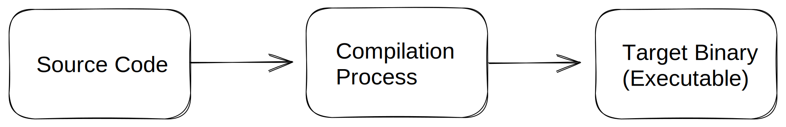

# ELF File Structure

## Program Structure

Programs begin as source code, which defines their behavior and computations for different inputs. The choice of programming language depends on the developer's preference and the application's needs. Some languages specialize in math and machine learning, web development, or mobile apps, while others like C/C++ offer flexibility for various application types, from low-level systems to large-scale software. Consequently, many programs analyzed in binary form initially originate from C/C++ code.

Computers cannot directly execute source code; it must be translated into machine instructions by compilers. In Linux for example, GCC is a widely used collection of compilers that includes a C compiler for converting C code into ELF binaries which can be directly executed. G++ also used for compiling C++ code. The compilation process is illustrated in Figure 2.1.



Reverse engineering is essentially the opposite of what a compiler does. Instead of starting with source code, reverse engineering begins with a program binary and attempts to understand the programmer's intended higher-level functionality. To facilitate this process, understanding the components and purposes of the ELF file format is beneficial.


### High-Level vs. Low-Level Languages

C and C++ are considered high-level programming languages because they allow developers to define a program's structure and behavior without digging into machine-specific details. This simplifies programming and offers greater speed and reliability compared to assembly language. C++ is built on C by introducing additional features like object-oriented programming (OOP).

Programmers also have the option to use low-level assembly language, which is closely tied to specific computer processors. This provides them with detailed control over machine-level instructions. The decision between high-level and low-level languages depends on several factors, as outlined in Table 2.1.

|                                                                             USE CASE                                                                            |                                                                                         EXAMPLES                                                                                         |
| :-------------------------------------------------------------------------------------------------------------------------------------------------------------: | :--------------------------------------------------------------------------------------------------------------------------------------------------------------------------------------: |
|                                      Hardware-specific code that operates outside of the standard C/C++ programmer’s model                                      |                                                       <ul><li>OS and hypervisor exception handlers</li><li>Firmware code</li></ul>                                                       |
| Code with strict restrictions on binary size, with limited instruction availability, or that needs to run before critical parts of the hardware are initialized | <ul><li>Firmware boot-sequences and self-test routines.</li><li>OS and hypervisor bootloaders and initialization sequences.</li><li>Shell-Code for use in exploit development.</li></ul> |
|                                     Accessing special-purpose instructions that C/C++ compilers will not normally generate.                                     |                                                              <ul><li>Access to hardware cryptographic instructions</li></ul>                                                             |
|               Performance-critical low-level library functions where hand-written assembly will be more efficient than compiler-generated assembly              |                                                                          <ul><li>memcpy</li><li>memset</li></ul>                                                                         |
|                     Library functions that do not use the standard C/C++ ABI (Application Binary Interface), or violate C/C++ ABI semantics                     |                                                     <ul><li>setjmp</li><li>longjmp</li><li>C++ exception handling internals</li></ul>                                                    |
|                                         Compiler and C-runtime internal routines that do not use the standard C/C++ ABI                                         |                                             <ul><li>C runtime initialization sequence</li></ul><ul><li>System call invocation stubs</li></ul>                                            |
|                                                                  Debugging and hooking programs                                                                 |      <ul><li>intercepting functions for analysis or to change program behavior </li><li>Breakpoint injection routines used by debuggers</li><li>Thread injection routines</li></ul>      |

Before digging into assembly language, it's important to understand how compilers convert high-level programming languages like C/C++ into low-level assembly code.

### The Compilation Process

The primary role of the compiler is to convert a program written in a high-level language like C/C++ into an equivalent assembly code, Let’s begin with a basic example program written in C.

<pre class="language-c" data-line-numbers><code class="lang-c">#include &#x3C;stdio.h>
#define GREETING "Hello"
		
int main(int argc, char** argv) {
    printf("%s ", GREETING);
    for(int i = 1; i &#x3C; argc; i++) {
      printf("%s", argv[i]);
      if(i != argc - 1)
        printf(" and ");
<strong>    }
</strong>    printf("!\n");
		return 0; 
}
</code></pre>

In Linux, GCC (GNU Compiler Collection) provides a common C compiler. It goes beyond compiling C programs to assembly code; it manages the entire compilation process, including assembling and linking, resulting in a final ELF program binary that can be executed directly by the operating system. Let's Compile our basic example code.

`null@arm64:~$ gcc main.c -o main.so`

Additionally, you can also compile the same code as C++ using "g++" since C++ is an extension of C.

`null@arm64:~$ g++ main.cpp -o main.so`

After GCC finishes its execution, it will result in an executable ELF file that can be directly run from the command line as follows

`null@arm64:~$ ./main.so learners explorers`

**`Hello learners and explorers!`**

#### Cross Compiling

High-level languages like C/C++ offer the advantage of not being bound to a specific processor architecture, allowing for cross-platform compatibility. GCC and G++ generate target binaries based on the host machine's architecture by default. For example, using "gcc main.c -o example.so" on a 64-bit Arm Linux machine results in an 64-bit Arm Compatible Binary, while the same exact command on an x86\_64 Linux machine results in an x86\_64 compatible binary.

You can determine the architecture for which an ELF binary is compiled by using the "file" command, as shown below:

`file`` `**`ARM32.o`**` ``printf32.o: ELF 32-bit LSB relocatable,`` `**`ARM`**`, EABI5 version 1 (SYSV),...`

`file`` `**`ARM64.so`**` ``printf64.so: ELF 64-bit LSB executable,`` `**`ARM aarch64`**`, version 1 (SYSV),...`

Using cross-compilers becomes a necessity when the host machine's architecture differs from the target machine's architecture. For instance, if we want to create a binary for an A64 (Arm 64-bit) processor on an x86\_64 host, we must use a cross-compiler. In Table 2.2, we listed the commonly used Arm cross-compilers for GCC and G++ compatible with both 32-bit and 64-bit Arm-based Linux systems.

| PACKAGE NAME            | PURPOSE              |
| ----------------------- | -------------------- |
| gcc-aarch64-linux-gnu   | AArch64 C compiler   |
| g++-aarch64-linux-gnu   | AArch64 C++ compiler |
| gcc-arm-linux-gnueabihf | AArch32 C compiler   |
| g++-arm-linux-gnueabihf | AArch32 C++ compiler |

To install arm cross-compilers using apt-get package manager:

`sudo apt-get install gcc-aarch64-linux-gnu g++-aarch64-linux-gnu gcc-arm-linux-gnueabihf g++-arm-linux-gnueabihf`

Installing cross-compilers allows you to create both 32-bit and 64-bit Arm binaries on any host with any other architecture. For instance, on an x86\_64 machine, you can generate a 64-bit Arm binary from C or C++ code, and vice versa.

`null@x86:~$ aarch64-linux-gnu-gcc example.c -o A64.so`&#x20;

`null@x86:~$ arm-linux-gnueabihf-gcc main.c -o A32.so`

When examining the output binaries using the "file" command, it shows that these program binaries are compiled for two different Arm architectures: 64-bit and 32-bit.

`null@x86:~$ file A64.so a64.so:`` `**`ELF 64-bit`**` ``LSB pie executable,`` `**`ARM aarch64`**`, version 1 (SYSV), ...`

`null@x86:~$ file A32.so a32.so:`` `**`ELF 32-bit`**` ``LSB pie executable,`` `**`ARM`**`, EABI5 version 1 (SYSV), ...`

### **Assembling and Linking**

Compilers and assembly programmers produce assembly code, used as an input for the assembler. The assembler's role is to translate human-readable machine instruction (assembly) into binary instructions (0's and 1's). It also includes data and/or metadata in the program binary as instructed by the programmer or compiler, resulting in an object file encoded as an Executable and Linkable Format **(ELF)** file. Object files are considered partial ELF files, "linking" step away from the executable target binary. Normally, assembly code is written in ".s" or ".asm" files, which can be assembled into object files using assemblers like the GNU Assembler (GAS).

Let's Write our first assembly code, which prints Hello World.&#x20;


```nasm

.arch armv8-a // Define architecture
.text // Begin .text section
.global main // Define global symbol main

main: // Start of the main function
    
    ldr x0, =MYSTRING // Load the address of MYSTRING into x0
    bl printf  // Call printf to print the string 
    mov x0, #0  // Move the value #0 into x0
    bl exit // Call exit(0)

.section .rodata // Define the .rodata section for the string
.balign 8  // Align our string to an 8-byte boundary

MYSTRING: // Define the MYSTRING label 
.asciz "Hello world\n" // Null-terminated ascii string
```



```nasm

.arch armv7-a // Define architecture
.section .text // Begin .text section
.global _start // Define global symbol main

_start: // Start of the main function

    ldr r0, =MYSTRING // Load the address of MYSTRING into x0
    bl printf  // Call printf to print the string
    mov r0, #0 // Move the value #0 into x0
    bl exit // Call exit(0)

.section .rodata // Define the .rodata section for the string
.balign 8  // Align our string to an 8-byte boundary

MYSTRING: // Define the MYSTRING label
.asciz "Hello world\n" // Null-terminated ascii string
```


Notice the difference between the two architectures.&#x20;

If our host machine matches the target architecture, we can assemble these programs directly using AS or GCC, as demonstrated below."

`null@ARM64:~$ as printf64.s -o printf64.o`

But when the host's architecture doesn't match the target's architecture, we can use GCC's cross-compiler versions of 'as'

`null@ARM64:~$ arm-linux-gnueabihf-as printf32.s -o printf32.o`

To be able to run the generated object file successfully, we need to go through a linking process. In the GCC suite, the linker is referred to as "ld" or "aarch64-linux-gnu-ld" and "arm-linux-gnueabihf-ld" for architecture-specific versions. We must provide all the necessary object files to the linker to create the final program binary and specify the output file using the "-o" option.

When using specific library functions in assembly programs instead of direct system calls, it's crucial to include the necessary object files. For example, in our 'printf64' example, "printf64.o" is required as an input object file. However, several other object files are also required for the program to function correctly. These include 'libc.so' to access libc library functions like printf and exit, as well as three object files that make up the C Runtime, responsible for initializing the process before executing the main function. Table 2.3 provides a description of the required object file dependencies.

|                                                                OBJECT FILE                                                               |                                                                                  PURPOSE                                                                                  |
| :--------------------------------------------------------------------------------------------------------------------------------------: | :-----------------------------------------------------------------------------------------------------------------------------------------------------------------------: |
| <ul><li>/usr/lib/aarch64-linux-gnu/crt1.o</li><li>/usr/lib/aarch64-linux-gnu/crti.o</li><li>/usr/lib/aarch64-linux-gnu/crtn.o </li></ul> | Implements the C runtime stubs that implements the \_start function that bootstraps the program, runs global C++ constructors, and then calls the program’s main function |
|                                                    /usr/lib/aarch64-linux-gnu/libc.so                                                    |                 The C runtime library export stubs needed to bootstrap the program and that references the printf and exit functions that our program uses                |

So, The final linker command line will be as the following:

`null@ARM64:~$ ld printf64.o /usr/lib/aarch64-linux-gnu/crt1.o /usr/lib/ aarch64-linux-gnu/crti.o /usr/lib/aarch64-linux-gnu/crtn.o /usr/lib/ aarch64-linux-gnu/libc.so -o printf64.so`

Then, We can successfully run our program:

`null@ARM64:~$ ./printf64.so Hello world!`

## The ELF File

Both compilation and linking process results in an ELF (Executable and Linkable Format) file, which contains essential information for the operating system and loader to run the program. The ELF file consists of three types of tables: the file header, program headers, and section headers. These tables outline how to load the program into memory and prepare it for execution.

### The ELF File Header

The ELF file header, found at the start of an ELF file, contains crucial information about the program. Including details such as the target architecture, program entry point, pointers and sizes of other tables in the file. To examine these attributes and sections in an ELF file like our "printf32.so" and "printf64.so" examples that we previously assembled and linked, you can use a tool like "readelf" To view the ELF file header, also, you can utilize the "-h" parameter to list the headers of the given binary.

`null@ARM64:~$ readelf printf64.so -h`

`null@ARM64:~$ readelf printf32.o -h`

<figure><figcaption><p>Figure2.3: <strong>Readelf output diff between printf64.so and print32.o</strong></p></figcaption></figure>

The ELF file header can be categorized into four main groups of fields:

* **ELF file header information.**
* **Information about the target platform of the program.**
* **The program entry point field.**
* **Fields specifying the locations of various tables within the file.**

#### The ELF File Header Information Field

The ELF file header's first group of fields serves various purposes for the loader:

1. **Magic Field**: It consists of a constant 16-byte binary pattern called the ident pattern. This pattern, starting with 0x7f followed by "ELF" in ASCII characters, signifies that the file is a valid ELF file.
2. **Class Field**: This field indicates whether the ELF file uses the 32-bit or 64-bit format. Typically, 32-bit programs use the 32-bit format, while 64-bit programs use the 64-bit format.
3. **Data Field**: It specifies whether the ELF file's internal fields should be interpreted as big-endian or little-endian. For ARM, little-endian encoding is commonly used for the ELF file format itself.
4. **Version Field**: This field specifies the version of the ELF file format being used, helping to ensure compatibility with future versions of the format.

#### The ELF File Target Platform Field.

1. **Machine Field**: This field specifies the processor class for which the program is intended. For example, a 64-bit Arm program sets this field to "AArch64," indicating compatibility with only 64-bit Arm processors. Meanwhile, a 32-bit Arm program specifies "ARM," indicating it can run on 32-bit Arm processors.
2. Flags Field: The flags field holds architecture-specific information that the loader might require. In the case of a 64-bit program, no architecture-specific flags are defined, and this field is set to zero. However, in the case of a 32-bit Arm program, this field provides the loader with details such as the usage of the embedded ABI (EABI) profile version 5 and the expectation of hardware support for floating-point operations. The e\_flags field in the ELF program header can take one of four specific Arm-defined values, as listed below in Table 2.4.

| VALUE                                  | DESCRIPTION                                                                                                                                                                                                                                              |
| -------------------------------------- | -------------------------------------------------------------------------------------------------------------------------------------------------------------------------------------------------------------------------------------------------------- |
| EF\_ARM\_ABIMASK (0xff000000)          | The top 8 bits of the e\_flags value in the ELF file header signify the specific ABI version being used. At present, these bits should be set to 5 (0x05000000), indicating that the ELF file is configured for EABI version 5.                          |
| EF\_ARM\_BE8 (0x00800000)              | Indicates that the ELF file contains BE-8 code.                                                                                                                                                                                                          |
| EF\_ARM\_ABI\_FLOAT\_HARD (0x00000400) | The specified value in the ELF file signifies adherence to the Arm hardware floating-point procedure call standard. This requires the processor to be Arm-V7 or newer and equipped with the VFP3-D16 floating-point hardware extension.                  |
| EF\_ARM\_ABI\_FLOAT\_SOFT (0x00000200) | The specified value in the ELF file indicates compliance with the software floating-point procedure call standard. In this standard, floating-point operations are simulated through calls to library functions rather than relying on hardware support. |

The "type" field in the ELF file header defines the purpose of the ELF file. In this context, it Identifies the programs as dynamically linked binaries, indicating that they can be prepared and executed by a system loader.

#### The Program’s Entry Point Field

The entry point field in the ELF header indicates where the program's execution begins. In C and C++ programs, execution typically starts at the **`main`** function, but it actually starts with a small assembly code stub called **`_start`**. When linked with the standard C runtime, **`_start`** transfers control to **`__libc_start_main`**, which sets up **`main`** with its parameters and invokes it. After **`main`** completes its execution and returns to **`__libc_start_main`**, the return value from **`main`** is passed to **`exit`** to terminate the program.

#### The Table Location Fields

The other fields in the ELF header are generally less relevant to binary analysts, unless they intend to manually parse ELF files. These fields provide information to the loader about the positions and quantities of program and section headers within the file. They also include pointers to special sections containing the string table and the symbol table, which will be discussed later. These details aid the loader in preparing the ELF file in memory for eventual execution.

### **ELF Program Headers**

The program headers table provide information to the loader about how to load the ELF binary into memory efficiently. Unlike section headers, which offer more-detailed program layout details, program headers use a mapping-centric approach. They define segments that instruct the kernel on how to initiate the program's execution. These segments provide information on where to load the ELF file's data into memory, whether a runtime loader is necessary for initialization, the initial configuration of the primary thread's thread-local-storage (TLS), and other kernel-related metadata.

We will examine the program headers of our A64 "printf64.so" example using "readelf" command.

`null@ARM64:~$ readelf printf64.so -lw`

```
Program Headers:
  Type           Offset   VirtAddr           PhysAddr           FileSiz  MemSiz   Flg Align
  PHDR           0x000040 0x0000000000000040 0x0000000000000040 0x0001f8 0x0001f8 R   0x8
  INTERP         0x000238 0x0000000000000238 0x0000000000000238 0x00001b 0x00001b R   0x1
      [Requesting program interpreter: /lib/ld-linux-aarch64.so.1]
  LOAD           0x000000 0x0000000000000000 0x0000000000000000 0x000904 0x000904 R E 0x10000
  LOAD           0x00fdc8 0x000000000001fdc8 0x000000000001fdc8 0x000278 0x000280 RW  0x10000
  DYNAMIC        0x00fdd8 0x000000000001fdd8 0x000000000001fdd8 0x0001e0 0x0001e0 RW  0x8
  NOTE           0x000254 0x0000000000000254 0x0000000000000254 0x000044 0x000044 R   0x4
  GNU_EH_FRAME   0x000820 0x0000000000000820 0x0000000000000820 0x00003c 0x00003c R   0x4
  GNU_STACK      0x000000 0x0000000000000000 0x0000000000000000 0x000000 0x000000 RW  0x10
  GNU_RELRO      0x00fdc8 0x000000000001fdc8 0x000000000001fdc8 0x000238 0x000238 R   0x1

 Section to Segment mapping:
  Segment Sections...
   00     
   01     .interp 
   02     .interp .note.gnu.build-id .note.ABI-tag .gnu.hash .dynsym .dynstr .gnu.version 
.gnu.version_r .rela.dyn .rela.plt .init .plt .text .fini .rodata .eh_frame_hdr .eh_frame 
   03     .init_array .fini_array .dynamic .got .got.plt .data .bss 
   04     .dynamic 
   05     .note.gnu.build-id .note.ABI-tag 
   06     .eh_frame_hdr 
   07     
   08     .init_array .fini_array .dynamic .got
```

The "printf64.so" program includes nine program headers, each assigned with a type like PHDR or INTERP, outlining how they should be interpreted. Furthermore, there's a section-to-segment listing that specifies which logical sections are inside each segment. For instance, the INTERP segment exclusively contains the ".interp" section.

Let's go through each of the nine program headers:

#### **The PHDR Program Header**

The PHDR (Program Header) is a meta-segment that contains the program header tables and metadata.

#### **The INTERP Program Header**

The INTERP header informs the operating system that the file requires another program, often the system loader, to load it into memory. This is crucial when a program relies on dynamically linked libraries. The external loader manages tasks like handling the global symbol table, connecting binaries through relocation, and eventually executing the program. This header is relevant for most programs except the loader itself and shared libraries loaded during program execution.

#### **The LOAD Program Headers**

LOAD headers in an ELF file guide the operating system and loader where and how to place the program's data into memory. Each LOAD header describes a memory region's size, permissions, alignment, and specifies which bytes should populate that region. \
Simply, LOAD headers guide how program data is organized in memory.

```
Type           Offset   VirtAddr           PhysAddr           FileSiz  MemSiz   Flg Align
LOAD           0x000000 0x0000000000000000 0x0000000000000000 0x000904 0x000904 R E 0x10000
LOAD           0x00fdc8 0x000000000001fdc8 0x000000000001fdc8 0x000278 0x000280 RW  0x10000
```

The program's memory layout is divided into two regions specified by LOAD headers:

1. The first region is 0x904 bytes in size with a 64KB alignment. It's marked as readable and executable but not writable. This region is filled with bytes from the ELF file.
2. The second region is 0x280 bytes long, located 0x1fdc8 bytes after the first region. It's designated as readable and writable. It will be filled with 0x278 bytes from the file, with the remaining 2 bytes left as zeros to pre-zero the .bss section during loading.

LOAD headers optimize the loading of data from the ELF file into memory, approximately corresponding to logical sections in the binary. The first LOAD header handles 17 logical sections, including read-only data and program code. The second LOAD header manages the remaining 7 sections, which include the global offset table, .data, and .bss sections.

```
Section to Segment mapping:
   02     .interp .note.gnu.build-id .note.ABI-tag .gnu.hash .dynsym .dynstr .gnu.version 
   .gnu.version_r .rela.dyn .rela.plt .init .plt .text .fini .rodata .eh_frame_hdr .eh_frame 
   03     .init_array .fini_array .dynamic .got .got.plt .data .bss
```

#### **The DYNAMIC Program Header**

The DYNAMIC program header is crucial for dynamic linking in ELF programs. It enables the loader to link programs to their shared-library dependencies and handle relocations to correct program code and pointers if the program is loaded at a different address than expected during runtime.

#### **The NOTE Program Header**

The NOTE program header stores vendor-specific metadata about the program in the form of key-value pairs, where each entry has a string name associated with a sequence of bytes describing the entry. The ELF documentation contains a list of recognized NOTE values and their meanings. "readelf" can view human-readable descriptions of these NOTE entries in an ELF file, helping understand metadata.

`null@ARM64:~$ readelf printf64.so -n`

```
Displaying notes found in: .note.gnu.build-id
  Owner                Data size        Description
  GNU                  0x00000014       NT_GNU_BUILD_ID (unique build ID bitstring)
    Build ID: b1c7342665355cf5e085a0220d67ea89bae2aa0e

Displaying notes found in: .note.ABI-tag
  Owner                Data size        Description
  GNU                  0x00000010       NT_GNU_ABI_TAG (ABI version tag)
    OS: Linux, ABI: 3.7.0
```

The NOTE entries in our example ELF file specify two key pieces of information:

* The expected GNU ABI version, which in this case is Linux ABI 3.7.0.
* A unique build ID value assigned to our binary. This build ID is typically used to link crash dumps with the binaries that caused them, aiding in the diagnosis and resolution of crashes.

#### The TLS Program Header

Although our example program doesn't use this specific header, there's a common program header called TLS (Thread-Local Storage) that defines a table of TLS entries. These entries contain information about thread-local variables utilized by the program. The concept of thread-local storage involves various sections and will be explored soon.

#### **The GNU\_EH\_FRAME Program Header**

This header specifies the memory location of stack unwind tables in the program. These tables are crucial for debuggers and C++ exception-handling runtime functions.

#### **The GNU\_STACK Program Header**

Historically, processors lacked no-execute (NX) memory protection, allowing code to be executed directly from the stack. This vulnerability was exploited by hackers through memory corruption flaws. The introduction of no-execute (NX) memory permission, supported by various processors, mitigated this vulnerability by marking the stack as non-executable using the Execute Never (XN) bit. However, Linux faced compatibility issues as some legitimate programs needed executable stacks.

The GNU\_STACK program header resolves this by allowing programs that don't run code from the stack to request non-executable stack protection. The memory protections for program thread stacks are defined in the header's memory-protection field. The linker `ld` creates the GNU\_STACK header, and GCC command-line options like `-z noexecstack` or \
`-z execstack` can be used to control stack executability.

To illustrate this, let’s recompile an example program with an intentionally executable stack and examine the GNU\_STACK header using `readelf`

`null@ARM64:~$ gcc printf64.c -o printf64-execstack.so -z execstack`

`null@ARM64:~$ readelf -lW printf64-execstack.so | grep GNU_STACK`

```
Type       Offset   VirtAddr           PhysAddr           FileSiz  MemSiz   Flg Align
GNU_STACK  0x000000 0x0000000000000000 0x0000000000000000 0x000000 0x000000 RWE 0x10
```

We can observe the impact of stack executability at runtime by examining a process's memory map. To aid this observation without relying on debugging, a simple two-line program that continuously sleeps can be used, allowing for real-time memory inspection.

```c
#include <unistd.h>
  int main() { for(;;) sleep(100); }
```

When compiling a program with the `-z execstack` option, the stack is intended to be marked as executable. To achieve this, the program is first compiled with this option.

`null@ARM64:~$ gcc sleep.c -o sleep.so -z execstack`

Let's run`./execstack.so` in one terminal window. In another terminal window, the process ID of the running program can be obtained using the `pidof` command.

`null@ARM64:~$ pidof sleep.so`

`145699`

Once we know the process ID of the running program, we can examine its memory map by accessing the `/proc/$PID/maps` directory which provides a detailed view of the program's memory layout.

`null@ARM64:~$ cat /proc/145699/maps`

```
<Trimmed>
ffffbf234000-ffffbf236000 r--p 0002e000 103:02 3670034                   /usr/lib/aarch64-linux-gnu/ld-linux-aarch64.so.1
ffffbf236000-ffffbf238000 rw-p 00030000 103:02 3670034                   /usr/lib/aarch64-linux-gnu/ld-linux-aarch64.so.1
ffffcfe67000-ffffcfe88000 rwxp 00000000 00:00 0                          [stack]
```

As shown above, the stack is shown with "rwx" permissions, indicating it is readable, writeable and executable.

Let's recompile our example program without the "-z execstack" option, the stack permissions would be "rw-" meaning it's readable, writeable but not executable.

`null@ARM64:~$ gcc sleep.c -o sleep.so`

```
<Trimmed>
ffff92ba1000-ffff92ba3000 r--p 0002e000 103:02 3670034                   /usr/lib/aarch64-linux-gnu/ld-linux-aarch64.so.1
ffff92ba3000-ffff92ba5000 rw-p 00030000 103:02 3670034                   /usr/lib/aarch64-linux-gnu/ld-linux-aarch64.so.1
fffffeeab000-fffffeecc000 rw-p 00000000 00:00 0                          [stack]
```

Inspecting memory for short-term programs can be more challenging. In such cases, using debuggers like GDB is recommended. Using GDB's process mappings to examine the process's memory actively while it's running.

#### **The GNU\_RELRO Program Header**

Similar to The GNU\_STACK, The GNU\_RELRO program header serves as a mitigation measure against compiler exploits. It implements Relocation Read-Only (RELRO), which directs the loader to mark critical areas of the program binary as read-only after loading but before execution. To prevent exploits that might attempt to overwrite crucial data. RELRO protects the Global Offset Table (GOT), the init and fini tables with function pointers executed before the main function and during program exit, respectively.

The RELRO program header operates by defining a memory region and specifying a final memory protection, enforced using an mprotect call after the program is prepared for execution.

```
Type           Offset   VirtAddr           PhysAddr           FileSiz  MemSiz   Flg Align
GNU_RELRO      0x00fdc8 0x000000000001fdc8 0x000000000001fdc8 0x000238 0x000238 R   0x1

Section to Segment mapping:
  Segment Sections...
   08     .init_array .fini_array .dynamic .got
```

RELRO mitigation offers two modes: Partial RELRO and Full RELRO. The linker can enable these modes or disable RELRO using specific command-line options.

| COMMAND-LINE OPTION | DESCRIPTION                                                                                         |
| ------------------- | --------------------------------------------------------------------------------------------------- |
| `znow`              | Enable the Full RELRO mitigation.                                                                   |
| `zrelro`            | Enable just the Partial RELRO mitigation, leaving lazy-loaded symbol function pointers unprotected. |
| `znorelro`          | Disable the RELRO mitigation entirely.                                                              |

Partial RELRO and Full RELRO differ in their protection of the Global Offset Table (GOT). \
Partial RELRO protection doesn't protect the part of the GOT responsible for the Procedure Linkage Table (usually named .plt.got), which is used for lazy binding of imported function symbols. \
Full RELRO enforces load-time binding for all library function calls and marks both .got and .got.plt sections as read-only.&#x20;

You can determine the RELRO status of a program binary using tools like checksec, which can be installed using `$ apt install checksec`

`null@ARM64:~$ gcc printf64.c -o printf64_norelro.so -znorelro`

`null@ARM64:~$ checksec --file=printf64_norelro.so`

```
RELRO           STACK CANARY      NX            PIE             RPATH      RUNPATH      Symbols         FORTIFY Fortified       Fortifiable     FILE
No RELRO        No canary found   NX enabled    PIE enabled     No RPATH   No RUNPATH   90 Symbols        No    0               1               printf64_norelro.so
```

`null@ARM64:~$ gcc printf64.c -o printf64_partialrelro.so -zrelro`

`null@ARM64:~$ checksec --file=printf64_partialrelro.so`

```
RELRO           STACK CANARY      NX            PIE             RPATH      RUNPATH      Symbols         FORTIFY Fortified       Fortifiable     FILE
Partial RELRO   No canary found   NX enabled    PIE enabled     No RPATH   No RUNPATH   90 Symbols        No    0               1               printf64_partialrelro.so
```

`null@ARM64:~$ gcc printf64.c -o printf64_fullrelro.so -znow`

`null@ARM64:~$ checksec --file=printf64_fullrelro.so`

```
RELRO           STACK CANARY      NX            PIE             RPATH      RUNPATH      Symbols         FORTIFY Fortified       Fortifiable     FILE
Full RELRO      No canary found   NX enabled    PIE enabled     No RPATH   No RUNPATH   89 Symbols        No    0               1               printf64_fullrelro.so
```

### ELF Section Headers

Unlike program headers, which focus on the efficient loading of the program into memory, section headers break down the ELF binary into logical units. The ELF program header specifies the section headers table's number and location in the ELF file. Let's examine the section headers of our example using the `objdump`.

`null@ARM64:~$ objdump -h printf64.so | head`

```
Sections:
Idx Name          Size      VMA               LMA               File off  Algn
  0 .interp       0000001b  0000000000000238  0000000000000238  00000238  2**0
                  CONTENTS, ALLOC, LOAD, READONLY, DATA
 12 .text         00000134  0000000000000640  0000000000000640  00000640  2**6
                  CONTENTS, ALLOC, LOAD, READONLY, CODE
 13 .fini         00000014  0000000000000774  0000000000000774  00000774  2**2
                  CONTENTS, ALLOC, LOAD, READONLY, CODE
 20 .got          00000030  000000000001ffb8  000000000001ffb8  0000ffb8  2**3
                  CONTENTS, ALLOC, LOAD, DATA
 21 .got.plt      00000040  000000000001ffe8  000000000001ffe8  0000ffe8  2**3
                  CONTENTS, ALLOC, LOAD, DATA
 22 .data         00000010  0000000000020028  0000000000020028  00010028  2**3
                  CONTENTS, ALLOC, LOAD, DATA
 23 .bss          00000008  0000000000020038  0000000000020038  00010038  2**0
                  ALLOC
 24 .comment      0000001f  0000000000000000  0000000000000000  00010038  2**0
```

Section headers, like program headers, define specific memory regions in the loaded binary. Each section header includes details such as address, size, name, type, and optional flags. For example, the .text section contains read-only code, while .data stores non-code, non-read-only data that is marked as read/write.

While some sections have a direct correspondence with program headers (such as .interp and NOTE sections), others like .text, .data, and .init\_array describe the program's logical structure and aid the loader in initializing the program before execution.

#### The ELF Meta Section

Within the binary file, two sections serve as meta-sections with special significance in the ELF file. These are:

* String Table: It defines the strings utilized within the ELF file.
* Symbol Table: It defines the symbols referenced in other sections of the ELF file.

#### The String Table Section

The string table in an ELF file serves as a repository for all the strings needed by the ELF file format but usually doesn't contain the string literals used by the program. It comprises a continuous sequence of strings in the ELF file, each terminated by a null byte.

Structures in the ELF file that require strings use the string table by specifying a string's value as an offset into this table. For instance, section headers are assigned names like .text, .data, or .strtab, and their name fields reference offsets in the string table. If, for example, the string .strtab is at offset 67 in the string table, the section header for the .strtab section will have the number 67 in its name field.

This creates a challenge for the loader because it needs to identify the string table before parsing the other sections of the ELF file. To solve this, the ELF program header provides a direct pointer to the string table, enabling the loader to locate it early in the loading process.

#### The Symbol Table Section

The symbol table in an ELF file defines the symbols utilized or defined by the program binary. Each symbol entry in the table includes the following information:

* A unique name (specified as an offset into the string table)
* The address (or value) of the symbol
* The size of the symbol
* Metadata about the symbol, including its type

The symbol table is a fundamental component of the ELF file format and is extensively used. Other tables in the ELF format that reference symbols do so by looking up entries in the symbol table.

#### Main ELF Sections

In an ELF file, some sections primarily define memory regions for code or data loading. These sections are marked as PROGBITS (or NOBITS), and the loader doesn't interpret their contents. However, in the context of reverse engineering, recognizing and understanding these sections is cruical.

The .**text section** usually holds the machine-code instructions generated by the compiler, marked as readable and executable but not writable, preventing accidental modification of program code. &#x20;

Global variables, whether explicitly defined as global or static function-local variables, exist in the **.data section**, reserving a static address throughout the program's lifetime. This section stores their initialized values, allowing both reading and overwriting during program execution.

The ELF file optimizes storage by using the **Block Starting Symbol (.bss) section** for uninitialized or zero-initialized global variables. This section initializes variables to zero before program startup, eliminating the need to store zero-filled templates in the ELF file, reducing file size, and improving startup efficiency.

The **.rodata section** contains read-only data that should not be modified during program execution. It contains global variables marked as constant, which are used in the program.

We can use objdump tool to dump the **.rodata** section contents from our printf64.so example.

`null@ARM64:~$ objdump -s -j .rodata print64.so`

```
Contents of section .rodata:
 4005b0 48656c6c 6f20776f 726c640a 00000000  Hello world.....
```

#### .tdata and .tbss Sections

The .tdata and .tbss sections are utilized by the compiler when programmers employ thread-local variables, which are global variables marked with the \_\_thread\_\_ local keyword in C++ or the compiler-specific \_\_thread keyword, like in GCC or clang.

### Symbols

In the ELF file format, a symbol refers to a named location within the program or an externally defined symbol. ELF symbols are listed in the main symbol table of the ELF file and can be associated with functions, global data objects, thread-local variables, runtime-internal objects (e.g., global offset table), and labels within functions. Let's use `readelf` to examine the symbol tables.

`null@ARM64:~$ readelf -s /lib/ld-linux-aarch64.so.1`

```
Symbol table '.dynsym' contains 41 entries:
   Num:    Value          Size Type    Bind   Vis      Ndx Name
     0: 0000000000000000     0 NOTYPE  LOCAL  DEFAULT  UND 
     1: 0000000000000e80     0 SECTION LOCAL  DEFAULT   10 .text
     2: 0000000000040028     0 SECTION LOCAL  DEFAULT   19 .data
     3: 0000000000007fd4   432 FUNC    GLOBAL DEFAULT   10 _[...]@@GLIBC_PRIVATE
     4: 0000000000012e90   440 FUNC    GLOBAL DEFAULT   10 _[...]@@GLIBC_PRIVATE
     5: 0000000000041290     1 OBJECT  GLOBAL DEFAULT   20 _[...]@@GLIBC_PRIVATE
     6: 000000000003fb88     8 OBJECT  GLOBAL DEFAULT   15 __st[...]@@GLIBC_2.17
     7: 000000000003fb90   672 OBJECT  GLOBAL DEFAULT   15 _[...]@@GLIBC_PRIVATE
     8: 000000000000fee0    44 FUNC    GLOBAL DEFAULT   10 _[...]@@GLIBC_PRIVATE
     9: 000000000002233c     4 OBJECT  GLOBAL DEFAULT   11 __rs[...]@@GLIBC_2.35
    10: 0000000000040028  4512 OBJECT  GLOBAL DEFAULT   19 _[...]@@GLIBC_PRIVATE
    11: 000000000000fc94   580 FUNC    GLOBAL DEFAULT   10 _[...]@@GLIBC_PRIVATE
    12: 0000000000000000     0 OBJECT  GLOBAL DEFAULT  ABS GLIBC_2.17
    13: 000000000003fb68     8 OBJECT  GLOBAL DEFAULT   15 __li[...]@@GLIBC_2.17
    <Trimmed>
```

In the symbol table of an ELF file, each symbol entry includes the following details:

* Symbol name
* Symbol binding attributes (e.g., weak, local, global)
* Symbol type, typically one of various predefined values
* Section index where the symbol exists
* Symbol value, often its memory address
* Size of the symbol, indicating the size in bytes for data objects or the length in bytes for functions.

|    VALUE   |                                         DESCRIPTION                                        |
| :--------: | :----------------------------------------------------------------------------------------: |
|   NOTYPE   |                         The symbol does not have a type specified.                         |
|   OBJECT   |                      The symbol corresponds to a global data variable.                     |
|    FUNC    |                            The symbol corresponds to a function.                           |
|   SECTION  |                           The symbol corresponds with a section.                           |
|    FILE    |                        The symbol corresponds to a source-code file.                       |
|     TLS    |                   The symbol corresponds to a thread-local data variable                   |
| GNU\_IFUNC | The symbol corresponds to a GNU-specific indirect function. (used for relocation purposes) |

#### Local vs. Global Symbols

**Local Symbols:**

* Not visible to programs outside the current ELF file.
* Ignored by the loader during dynamic linking.
* Limited to the scope of the current ELF file.
* Multiple ELF files can have local symbols with the same name.

**Global Symbols:**

* Intended to be shared outside of the program or shared library.
* Only one global symbol with a specific name is allowed across the entire program.
* Used for functions or data that need to be accessed by other programs or libraries.

#### Weak Symbols

Weak symbols in ELF files are symbols that can be overridden by other libraries, providing a mechanism for creating default implementations that are replaceable. They are commonly used for functions like malloc, allowing programs to use their custom implementations without **function hooking**. This is achieved through attributes like **attribute**((weak)) in GCC or #pragma weak in C/C++ code, making it easier to substitute default functionality with program-specific alternatives.

#### Symbol Versions

Symbol versioning is a mechanism used in ELF files, often found in system libraries like glibc. It addresses the need to update programs without breaking their application binary interface (ABI). When a breaking change is required, symbol versioning allows programs to define both old and new versions of a symbol, each marked with different versions. Programs compiled against the new version will use the updated symbol, while those compiled against the old version will use the older one, maintaining ABI compatibility.

Symbol versioning can also be used to restrict access to specific symbols, ensuring they are only used by certain libraries. For instance, the GLIBC\_PRIVATE symbol is used to hide internal glibc symbols, preventing other programs from accidentally accessing them. Symbol versioning is managed through sections in the ELF file, specifically .gnu.version\_d and .gnu.version.

#### Mapping Symbols

Mapping symbols are specific to the Arm architecture and serve to clarify how the content in .text sections of Arm binaries should be interpreted. In cases where a .text section contains multiple types of content, such as both 32-bit Arm instructions, Thumb instructions, and constants, mapping symbols aid debuggers and disassemblers in understanding the byte-level interpretation of the section. Importantly, these symbols are informative and do not alter how the processor interprets the data within the section.

| SYMBOL | DESCRITPION                                                            |
| ------ | ---------------------------------------------------------------------- |
| $a     | The instructions following this symbol are in the A32 instruction set. |
| $t     | The instructions following this symbol are in the T32 instruction set. |
| $x     | The instructions following this symbol are in the A64 instruction set. |
| $d     | The instructions following this symbol are constant data.              |

### **Dynamic Section and Dynamic Loading**

The .dynamic section provides instructions to the loader for linking and preparing the binary for execution. To view the dynamic section in detail, let's use `readelf -d`.

`null@ARM64:~$ readelf -d printf64.so`

```
Dynamic section at offset 0xfdd8 contains 26 entries:
  Tag        Type                         Name/Value
 0x0000000000000001 (NEEDED)             Shared library: [libc.so.6]
 0x000000000000000c (INIT)               0x5b8
 0x000000000000000d (FINI)               0x774
 0x0000000000000019 (INIT_ARRAY)         0x1fdc8
 0x000000000000001b (INIT_ARRAYSZ)       8 (bytes)
 0x000000000000001a (FINI_ARRAY)         0x1fdd0
 0x000000000000001c (FINI_ARRAYSZ)       8 (bytes)
 0x000000006ffffef5 (GNU_HASH)           0x298
 0x0000000000000005 (STRTAB)             0x3a8
 0x0000000000000006 (SYMTAB)             0x2b8
 0x000000000000000a (STRSZ)              146 (bytes)
 0x000000000000000b (SYMENT)             24 (bytes)
```

The dynamic section contains instructions for the loader to process various sections, preparing the program for execution. Each entry in this section has a type indicating its interpretation and a location relative to the dynamic section's start. Interestingly, the dynamic header has its own symbol and string tables, specified by the SYMTAB and STRTAB entries, with sizes determined by SYMENT and STRSZ respectively.

#### The NEEDED **Dependency**

The NEEDED entry in the dynamic table is crucial for programs that rely on external libraries functions. Programs specify their dependencies through NEEDED directives in the dynamic section, and during loading, the loader loads these shared-library dependencies, as well as their dependencies recursively. This process ensures that all required libraries are loaded and ready for use.

#### Program Relocations

The loader's second task, after loading program dependencies, is to perform relocation and linking. There are two formats for relocation tables: REL and RELA, with the number of relocations specified in the dynamic section's RELSZ or RELASZ fields, respectively. The types of relocations vary by instruction set architecture. Generally, relocations fall into three categories: static relocations for non-default address loading, dynamic relocations for external symbols, and thread-local relocations for thread-local variables.

**Static Relocations**

ELF files typically specify a preferred memory address in program headers. However, the loader or operating system may load the program or shared library at a different address, known as the relocation bias, due to various reasons, including address space layout randomization (ASLR) for security. Loading at a different address can cause problems because the program encodes pointers to its code and data, making them invalid if the program isn't loaded at the preferred address.

To address this issue, two strategies can be used:

1. Compiling the program as position-independent code (PIC), which avoids static relocations by dynamically determining its location.
2. Applying relocation "fixups" to adjust pointers and instructions in the program to work correctly when loaded at a different address.

**Dynamic Relocations**

During program loading, the loader maintains a database of symbols defined within the current program and its shared library dependencies. As the loader processes dynamic relocations, which involve references to symbols defined externally, it checks the relocation's symbol entry to identify the imported symbol's name. The loader then compares this symbol name against its database of symbols.

If a match is found in the database, the loader updates the relocation entry with the absolute address of the symbol. For example, if a program references a symbol like malloc from a shared library libc.so, the loader loads libc.so, adds its externally visible symbols to the database, and records the address of malloc. When processing the program's relocations, the loader encounters a reference to malloc and uses the database to find its address and updates the corresponding relocation entry in the program's global offset table.

So, If libc.so is loaded to address 0x1000000 and malloc is at offset 0x3000 in this file, the malloc symbol’s address will be stored in the database as 0x1003000.

**Global Offset Table**

Dynamic relocations can involve resolving the same symbol, such as malloc, multiple times within a program. However, this process can be inefficient due to the time-consuming nature of symbol lookups in the global symbol table. To optimize this, the Global Offset Table (.got) section centralizes the resolution of external symbols.

Instead of repeatedly looking up the same symbol, the GOT simplifies symbol resolution so that each symbol is looked up only once. For instance, if a program uses malloc in 256 different locations, it generates only one relocation request for the loader to find malloc and stores its address in the corresponding GOT slot. During runtime, calls to malloc can be efficiently performed by loading the address from this slot and branching to it, significantly improving performance.

**Procedure Linkage Table**

To optimize symbol binding, especially in cases where a program imports many symbols but doesn't use all of them in every run, a technique known as **lazy binding** is Used. It delays symbol resolution until just before a symbol's first usage, thus avoiding the performance cost of resolving unused symbols. This is typically implemented using the Procedure Linkage Table (PLT).

The PLT includes small functions or "stubs" that are designed to call the imported functions. Imported function calls in the program are replaced by calls to the corresponding PLT stubs (e.g., malloc@plt) during linking. When a PLT stub is first invoked, it triggers a lazy-loading routine that resolves the symbol's actual address and then redirects the call to that address. Subsequent calls to the PLT stub use the previously resolved address directly.

This optimization ensures that each function symbol is loaded only once per program run, right before its initial usage.

#### **ELF Initialization and Termination Sections**

The ELF program has various steps before it can start running its main code. One crucial step is running initialization routines for the program. In C and C++ programs, execution starts at the main function and ends when it returns. However, there's more under the hood.

In C, global variables can either be initialized with a constant value or left uninitialized. Initialized variables are stored in the .data section, and uninitialized ones in the .bss section.

C++ is more complex because it allows custom types like classes. These types can have [constructors](https://www.geeksforgeeks.org/difference-between-constructor-and-destructor-in-c/) that run when the variable is created and destructors that run when the variable goes out of scope. For global variables in C++, they come into scope before the main function is called and leave scope when the program ends or the shared library unloads. This process is known as dynamic initialization.

So, both C and C++ have specific ways of handling program initialization before the main code runs.

```cpp
#include <stdio.h>
         class AutoInit {
         public:
           AutoInit() {
             printf(“AutoInit::ctor\n”);
           }
           ~AutoInit() {
             printf(“AutoInit::dtor\n”);
           }
};
         AutoInit globalVar;
         int main() {
           printf(“main\n”);
           return 0;
}
```

This program includes a global variable of the type **`AutoInit`**, which is a C++ class with a constructor and a destructor. Both of these functions print messages to the console. The program also contains a **`main`** function that prints a message and then exits.

When we compile and run the program, it produces some output.

`null@ARM64:~$ ./init.so`&#x20;

`AutoInit::ctor` \
`main` \
`AutoInit::dtor`

Under the hood, C++ keeps track of constructors and destructors for global variables. These functions are stored in lists called **CTOR\_LIST** and **DTOR\_LIST**. Destructors are called in reverse order during program exit. Even though these lists are mainly for C++, C programs can also use them with special annotations like **attribute**((constructor)) and **attribute**((destructor)).

There are two strategies for ensuring constructors and destructors run before the program's main function. The first approach generates init and fini functions, which are called before main and during program exit, respectively. The second approach references the entire **CTOR\_LIST** and **DTOR\_LIST**. These strategies are specified in the ELF file's dynamic section.

_**Initialization and Termination Order**_

Initialization and termination in programs can involve various strategies. When using multiple strategies, the order of initialization follows these steps:

1. The program is loaded into memory using program headers, which pre-initializes global variables. Static global variables are initialized at this stage, and uninitialized variables in .bss are set to zero.
2. The loader ensures that all dependencies for the program or shared library are fully loaded and initialized before starting dynamic linking.
3. Nonzero entries in FINI\_ARRAY and the FINI function (if defined) are registered via the **`atexit`** function for programs or, for shared libraries, during **`dlclose`** (or during exit if the shared library is still loaded).
4. If the program has a PREINIT\_ARRAY entry, each nonzero entry in that array is called in sequence.
5. If the program has an INIT\_ARRAY entry, each nonzero entry in that array is called next.
6. If the program has an INIT entry, the loader directly calls the first instruction in that section to run the init stub.
7. The module is now initialized. If it's a shared library, **`dlopen`** can return. If it's a program during startup, the loader calls the program's entry point to start the C runtime and begin the process of invoking the **`main`** function.
